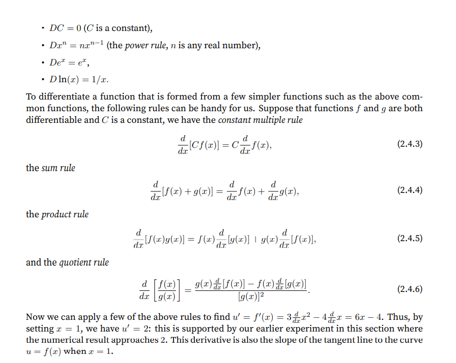
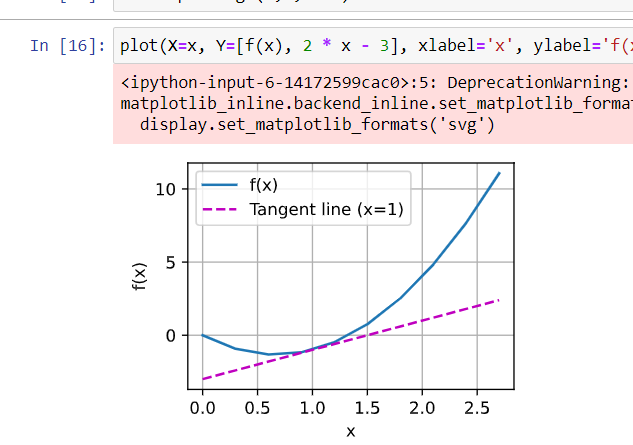
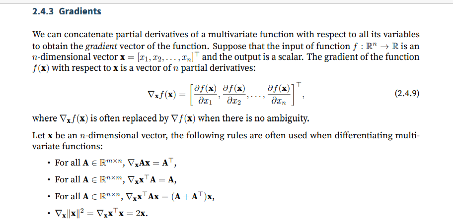
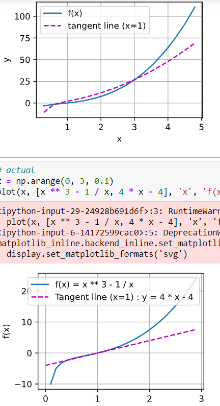
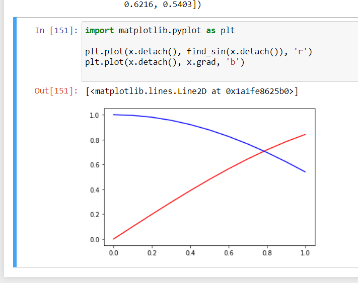
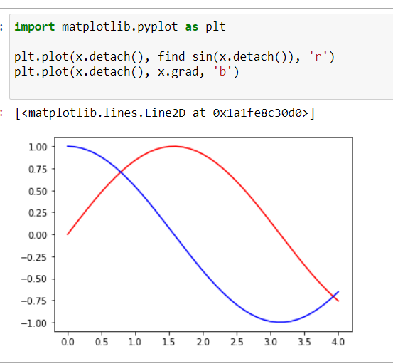
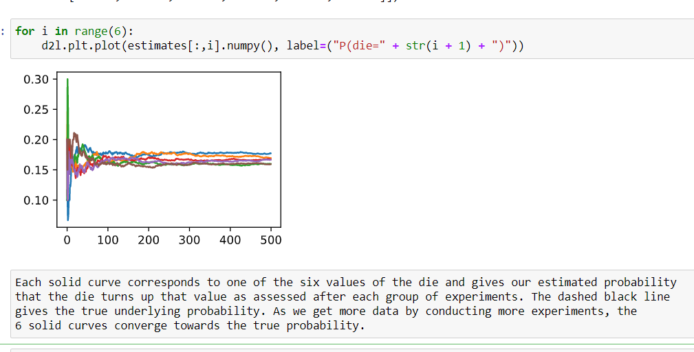
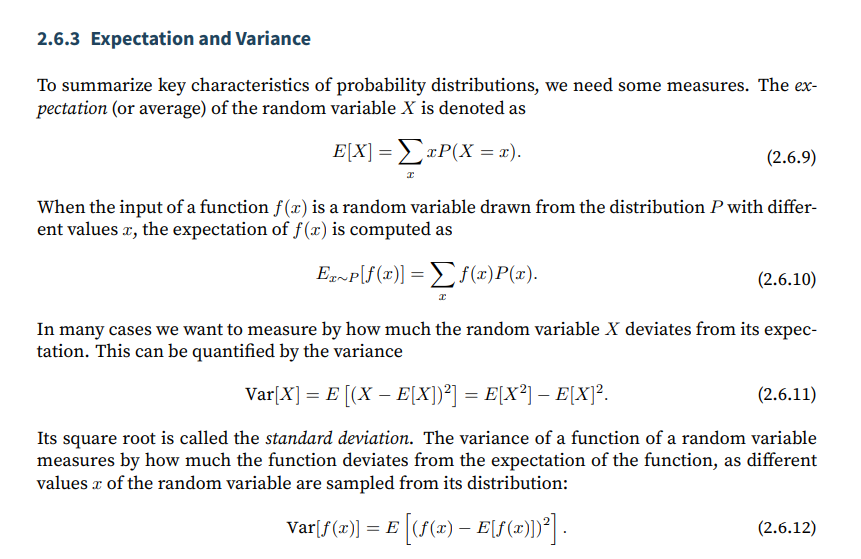
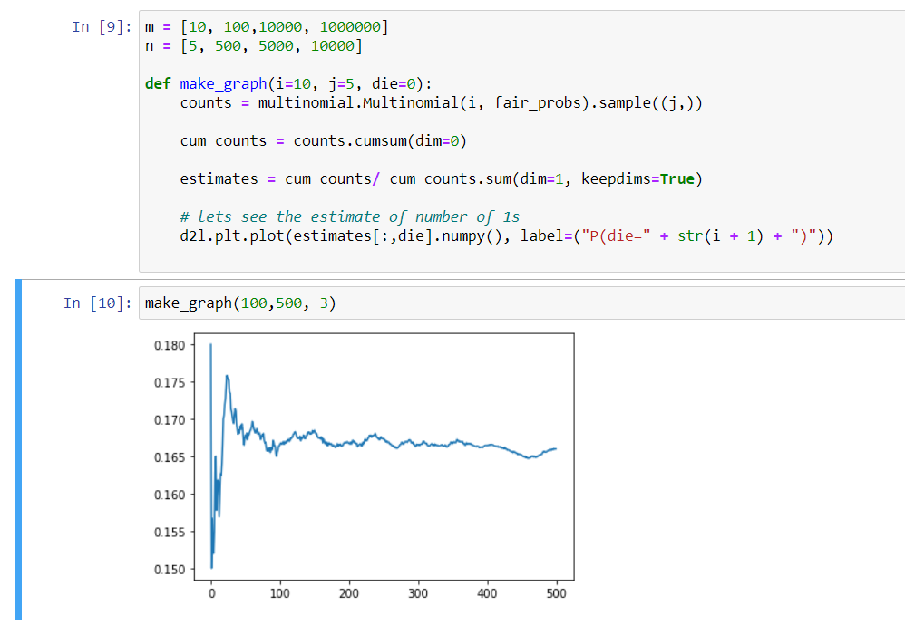

# Dive into Deep Learning book repo

## Installation

https://d2l.ai/chapter_installation/index.html#subsec-gpu


-----

# Important functions saved into d2l

1. load_array - page 103
2. synthetic_data - page 97
3. sgd - page 100
4. linreg - page 100
5. squared_loss - page 100
6. Timer - page 92
7. use_svg_display, set_figsize - page 68
8. Animator - page 122
9. Accuracy - page 120
10. cross_entropy - page 120
11. evaluate_loss - page 149
12. load_fashion_mnist - page 116
13. show_images - page 115
14. get_fashion_mnist_labels - page 115
15. train_ch3 - page 121
16. download - page 189
17. corr2d - page 230
18. evaluate_accuracy_on_gpu - page 250
19. train_ch6 - page 251

# Ch1 Introduction 

### Types of machine learning

1. Regression

2. Classification

3. Tagging - tagging in medical journels

4. Recommendation systems

5. Search - order matters

6. Sequence learning

7. Unsupervised learning - distributing shift - test and train data sufficiently differ.

### Innovations along the way

1. Dropout

2. arrentionmechanism

3. multi stage designs

4. generative adverserial network

5. parallel computing

## 1.9. Exercises

- Which parts of code that you are currently writing could be “learned”, i.e., improved by learning and automatically determining design choices that are made in your code? Does your code include heuristic design choices?

- I want to make a summary writing tool

- Which problems that you encounter have many examples for how to solve them, yet no specific way to automate them? These may be prime candidates for using deep learning.

- creating speech fakes

- Viewing the development of AI as a new industrial revolution, what is the relationship between algorithms and data? Is it similar to steam engines and coal? What is the fundamental difference?

- more coal more steam, here the quality of data is important

Where else can you apply the end-to-end training approach, such as in Fig. 1.1.2, physics, engineering, and econometrics?

- philosphical experiments

----

# Ch2 Preliminaries

## 2.1 Mathematical operation

- In mathematical notation, we would denote such a unary scalar operator (taking one input) by the
signature `f : R → R`. This just means that the function is mapping from any real number (R) onto
another. Likewise, we denote a binary scalar operator (taking two real inputs, and yielding one
output) by the signature `f : R, R → R`.

- Element wise operation :
Given any two vectors u and v of the same shape, and a binary
operator f, we can produce a vector `c = F(u, v)` by setting ci ← f(ui, vi) for all i, where ci, ui, and vi are the ith elements of vectors c,u, and v. Here, we produced the vector-valued F : Rd,d → Rd
by lifting the scalar function to an elementwise vector operation.

### Braodcasting mechanism

-  Used by pytorch when dealing with unequal tensor

### saving memory

- Every time we allocate a tensor the memory location is initialised
- So we have the cnoceptof inplace vector

### Ocnverting to other python objects

- converting to a numpy tensor

- converting to a scalar using torch,item.

### Exercises
1. Run the code in this section. Change the conditional statement X == Y in this section to X <
Y or X > Y, and then see what kind of tensor you can get.

- done

2. Replace the two tensors that operate by element in the broadcasting mechanism with other
shapes, e.g., 3-dimensional tensors. Is the result the same as expected?


## 2.2 Handling data

1. NA values can be handled by imputation and deletion
    - Imputation - feeding appropriate values
    - Deletion - deleting

2. iloc to take individual rows and columns

3. handling null data items - 
    - `fill.na()` - for handling data items
    - `pd.get_dummies(input, dummy_na=True)` - for categorical values

### Exercises

Create a raw dataset with more rows and columns.
1. Delete the column with the most missing values.
2. Convert the preprocessed dataset to the tensor format.


## 2.3 Linear Algebra

- scalars -  we will punt on rigorous definitions of what precisely space is, but just
remember for now that the expression x ∈ R is a formal way to say that x is a real-valued scalar.
The symbol ∈ can be pronounced “in” and simply denotes membership in a set. Analogously, we
could write x, y ∈ {0, 1} to state that x and y are numbers whose value can only be 0 or 1

- Vectors- list of scalar values. r. In math notation, if we want to say that a vector x
consists of n real-valued scalars, we can express this as x ∈ R^n

- Matrices - In math notation, we use A ∈ R^m×n
to express that the matrix A consists of m rows and n columns
of real-valued scalars. Visually, we can illustrate any matrix A ∈ R^m×n as a table, where each
element aij belongs to the ith row and jth column.

- Tensor - n dimensional matrices of arbitary axis

## maths operations

```javascript
- Specifically, elementwise multiplication of two matrices is called their Hadamard product (math
notation ⊙). Consider matrixB ∈ R
m×n whose element of row i and column j is bij . The Hadamard
product of matrices A (defined in (2.3.2)) and B
```

```javascript
- Sum() -  We can express sums over the elements of tensors of arbitrary shape. For example, the sum of the
elements of an m × n matrix A could be written ∑mi=1 ∑nj=1 aij
```
- By default, invoking the function for calculating the sum reduces a tensor along all its axes to a
scalar. We can also specify the axes along which the tensor is reduced via summation. Take matrices as an example. To reduce the row dimension (axis 0) by summing up elements of all the
rows, we specify axis=0 when invoking the function. Since the input matrix reduces along axis 0
to generate the output vector, the dimension of axis 0 of the input is lost in the output shape.

```javascript
- Dot product -  Given two vectors x, y ∈ Rd
, their dot product x⊤y (or⟨x, y⟩) is a sum over the products of the elements at the same position: x
⊤y =∑di=1 xiyi
```

```javascript
- Dot products are useful in a wide range of contexts. For example, given some set of values, denoted
by a vector x ∈ Rd and a set of weights denoted by w ∈ Rd, the weighted sum of the values in x
according to the weights w could be expressed as the dot product x⊤w. When the weights arenon-negative and sum to one (i.e., (∑di=1 wi = 1)), the dot product expresses a weighted average.
After normalizing two vectors to have the unit length, the dot products express the cosine of the
angle between them. We will formally introduce this notion of length later in this section.
```

In linear algebra, a vector norm is a function f that maps a vector to a scalar, satisfying a handful
of properties. Given any vector x, the first property says that if we scale all the elements of a vector
by a constant factor α, its norm also scales by the absolute value of the same constant factor:
    `f(αx) = |α|f(x). (2.3.10)`

The second property is the familiar triangle inequality:
    `f(x + y) ≤ f(x) + f(y). (2.3.11)`

The third property simply says that the norm must be non-negative:
    `f(x) ≥ 0. (2.3.12)`

That makes sense, as in most contexts the smallest size for anything is 0. The final property requires that the smallest norm is achieved and only achieved by a vector consisting of all zeros.
    `∀i, [x]i = 0 ⇔ f(x) = 0. (2.3.13)`

You might notice that norms sound a lot like measures of distance. And if you remember Euclidean
distances (think Pythagorasʼ theorem) from grade school, then the concepts of non-negativity and
the triangle inequality might ring a bell. In fact, the Euclidean distance is a norm: specifically it
is the L2 norm. Suppose that the elements in the n-dimensional vector x are x1, . . . , xn.
The L2 norm of x is the square root of the sum of the squares of the vector elements.

L1 norma is sum of abs valuees

- While we do not want to get too far ahead of ourselves, we can plant some intuition already about
why these concepts are useful. In deep learning, we are often trying to solve optimization problems: maximize the probability assigned to observed data; minimize the distance between predictions and the ground-truth observations

### Exercises

Done in notebook

1. Prove that the transpose of a matrix Aʼs transpose is A.

2. Given two matrices A and B, show that the sum of transposes is equal to the transpose of a
sum.
3. Given any square matrix A, is A + A
⊤ always symmetric? Why?
4. We defined the tensor X of shape (2, 3, 4) in this section. What is the output of len(X)?
5. For a tensor X of arbitrary shape, does len(X) always correspond to the length of a certain
axis of X? What is that axis?
6. Run A / A.sum(axis=1) and see what happens. Can you analyze the reason?


7. When traveling between two points in Manhattan, what is the distance that you need to cover
in terms of the coordinates, i.e., in terms of avenues and streets? Can you travel diagonally?
8. Consider a tensor with shape (2, 3, 4). What are the shapes of the summation outputs along
axis 0, 1, and 2?
9. Feed a tensor with 3 or more axes to the linalg.norm function and observe its output. What
does this function compute for tensors of arbitrary shape?

## Differential Calculus

- Made with the intention of finding approximations.

- In machine learning the goal is optimization and generalisation

- In ML, we choose functions that are differentiable with respect to model parameters.

- Put simply, this means that for each parameter,
we can determine how rapidly the loss would increase or decrease, were we to increase or decrease
that parameter by an infinitesimally small amount.


- Rules of differentiation 



- plots in d2l



- partial derivatives - in multivariate function taking derivative keeping all other variable constant

- gradients - when we concatenate the partial derivatives of a mutivariate function with respect to its derivative we get gradient



- chain rule given y as a function of x, where y is differentiable by u and u is differentiable by x , then `dy/dx = dy/du * du/dx`

### Exercises
1. Plot the function y = f(x) = x
and its tangent line when x = 1.



rest in notebook:

2. Find the gradient of the function f(x) = 3x
3. What is the gradient of the function f(x) = ∥x∥2?
4. Can you write out the chain rule for the case where u = f(x, y, z) and x = x(a, b), y = y(a, b),
and z = z(a, b)?

## automatic differentiation

- Before we even calculate the gradient of y with respect to x, we will need a place to store it. It is
    important that we do not allocate new memory every time we take a derivative with respect to a
    parameter because we will often update the same parameters thousands or millions of times and
    could quickly run out of memory.

- given x , the values of y= f(x) the grad with respect to x is stored in x.grad, you need to call x.requires_grad_(True)

- Backward for non scalar vector - we need to call backward by converting to scalar , for example y is a vector then y.sum().backward()

- detaching computation - Sometimes, we wish to move some calculations outside of the recorded computational graph. For
    example, say that y was calculated as a function of x, and that subsequently z was calculated as a
    function of both y and x. Now, imagine that we wanted to calculate the gradient of z with respect
    to x, but wanted for some reason to treat y as a constant, and only take into account the role that
    x played after y was calculated.

- Here, we can detach y to return a new variable u that has the same value as y but discards any
    information about how y was computed in the computational graph. In other words, the gradient
    will not flow backwards through u to x. Thus, the following backpropagation function computes
    the partial derivative of z = u * x with respect to x while treating u as a constant, instead of the
    partial derivative of z = x * x * x with respect to x.

### Exercises

given in notebook

1. Why is the second derivative much more expensive to compute than the first derivative?
2. After running the function for backpropagation, immediately run it again and see what happens.
3. In the control flow example where we calculate the derivative of d with respect to a, what
would happen if we changed the variable a to a random vector or matrix. At this point, the
result of the calculation f(a) is no longer a scalar. What happens to the result? How do we
analyze this?
4. Redesign an example of finding the gradient of the control flow. Run and analyze the result.
5. Let f(x) = sin(x). Plot f(x) and df(x)
dx , where the latter is computed without exploiting that
(x) = cos(x).



On magnifying



## Probability

- basic probability theory - 
- sampling - drawing examples usually from a multinomial distributions



- axioms of probability

    • For any event A, its probability is never negative, i.e., P(A) ≥ 0;
    • Probability of the entire sample space is 1, i.e., P(S) = 1;
    • For any countable sequence of events A1, A2, . . . that are mutually exclusive (Ai∩Aj = ∅ for all
    i ̸= j), the probability that any happens is equal to the sum of their individual probabilities,
    i.e., P(
    ∪∞
    i=1 Ai) = ∑∞
    i=1 P(Ai).


- random variables - in which proabbility is measured in terms of discrete variables
- dealing with multiple random variables 

    - joint random variables - The first is called the joint probability P(A = a, B = b). Given any values a and b, the joint probability lets us answer, what is the probability that A = a and B = b simultaneously? Note that for
    any values a and b, P(A = a, B = b) ≤ P(A = a). This has to be the case, since for A = a and
    B = b to happen, A = a has to happen and B = b also has to happen (and vice versa). Thus, A = a
    and B = b cannot be more likely than A = a or B = b individually

- conditional probability - This brings us to an interesting ratio: 0 ≤
    P(A=a,B=b)
    P(A=a) ≤ 1. We call this ratio a conditional probability
    and denote it by P(B = b | A = a): it is the probability of B = b, provided that A = a has occurred.

- Bayes theoram - Using the definition of conditional probabilities, we can derive one of the most useful and celebrated equations in statistics: Bayes’ theorem. It goes as follows. By construction, we have the
    multiplication rule that P(A, B) = P(B | A)P(A). By symmetry, this also holds for P(A, B) =
    P(A | B)P(B). Assume that P(B) > 0. Solving for one of the conditional variables we get
    P(A | B) = P(B | A)P(A)
    P(B)

    Note that here we use the more compact notation where P(A, B)is a joint distribution and P(A | B)
    is a conditional distribution. Such distributions can be evaluated for particular values A = a, B = b.

- Marginalization
    Bayesʼ theorem is very useful if we want to infer one thing from the other, say cause and effect,
    but we only know the properties in the reverse direction, as we will see later in this section. One
    important operation that we need, to make this work, is marginalization. It is the operation of
    determining P(B) from P(A, B). We can see that the probability of B amounts to accounting for
    all possible choices of A and aggregating the joint probabilities over all of them:
    P(B) = ∑A.P(A, B)
    which is also known as the sum rule. The probability or distribution as a result of marginalization
    is called a marginal probability or a marginal distribution 

- Independence - 
    Another useful property to check for is dependence vs. independence. Two random variables A and
    B being independent means that the occurrence of one event of A does not reveal any information
    about the occurrence of an event of B. In this case P(B | A) = P(B). Statisticians typically
    express this as A ⊥ B. From Bayesʼ theorem, it follows immediately that also P(A | B) = P(A).
    In all the other cases we call A and B dependent. For instance, two successive rolls of a die are
    independent. In contrast, the position of a light switch and the brightness in the room are not
    (they are not perfectly deterministic, though, since we could always have a broken light bulb,
    power failure, or a broken switch).
    Since P(A | B) = P(A,B)
    P(B) = P(A) is equivalent to P(A, B) = P(A)P(B), two random variables are
    independent if and only if their joint distribution is the product of their individual distributions.
    Likewise, two random variables A and B are conditionally independent given another random variable C if and only if P(A, B | C) = P(A | C)P(B | C). This is expressed as A ⊥ B | C.

- Expectation and variance - 



### Exercises
1. We conducted m = 500 groups of experiments where each group draws n = 10 samples.
Vary m and n. Observe and analyze the experimental results.



2. Given two events with probability P(A) and P(B), compute upper and lower bounds on
P(A ∪ B) and P(A ∩ B). (Hint: display the situation using a Venn Diagram43.)

* dont know

3. Assume that we have a sequence of random variables, say A, B, and C, where B only depends on A, and C only depends on B, can you simplify the joint probability P(A, B, C)?

* dont know

P(A,B|C) formula of naive bayes needs to be applied

(Hint: this is a Markov Chain44.)
4. In Section 2.6.2, the first test is more accurate. Why not run the first test twice rather than
run both the first and second tests?

* dont know. Both experiment may not be independent i missed the point of experiment

## Documentation

1. finding all functions and distributions
    `print(torch.distributions)`
2. usage of specific functions
    `help(torch.ones)`

### Exercises
1. Look up the documentation for any function or class in the deep learning framework. Can
you also find the documentation on the official website of the framework.

* I have looked up the documenation of fastai before.


