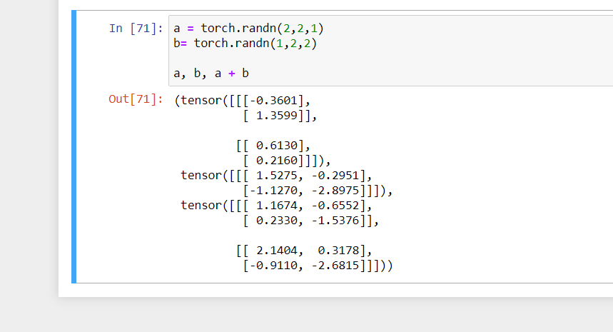
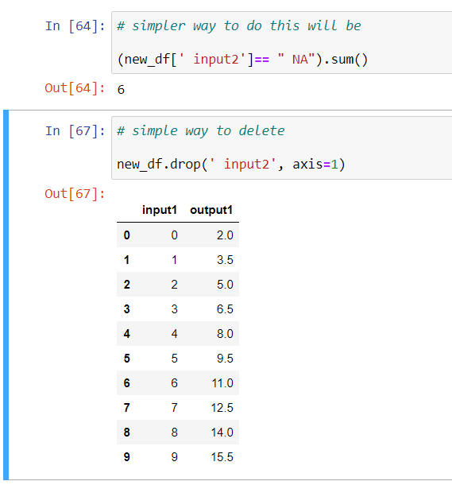
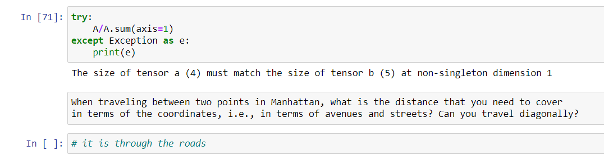
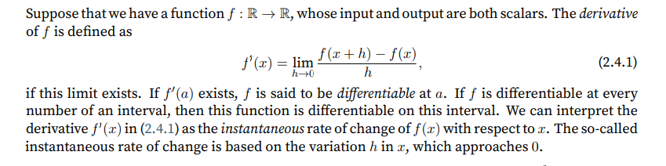

# Dive into Deep Learning book repo

## Installation

https://d2l.ai/chapter_installation/index.html#subsec-gpu


-----

# Ch1 Introduction 

### Types of machine learning

1. Regression

2. Classification

3. Tagging - tagging in medical journels

4. Recommendation systems

5. Search - order matters

6. Sequence learning

7. Unsupervised learning - distributing shift - test and train data sufficiently differ.

### Innovations along the way

1. Dropout

2. arrentionmechanism

3. multi stage designs

4. generative adverserial network

5. parallel computing

## 1.9. Exercises

- Which parts of code that you are currently writing could be “learned”, i.e., improved by learning and automatically determining design choices that are made in your code? Does your code include heuristic design choices?

- I want to make a summary writing tool

- Which problems that you encounter have many examples for how to solve them, yet no specific way to automate them? These may be prime candidates for using deep learning.

- creating speech fakes

- Viewing the development of AI as a new industrial revolution, what is the relationship between algorithms and data? Is it similar to steam engines and coal? What is the fundamental difference?

- more coal more steam, here the quality of data is important

Where else can you apply the end-to-end training approach, such as in Fig. 1.1.2, physics, engineering, and econometrics?

- philosphical experiments

----

# Ch2 Preliminaries

## 2.1 Mathematical operation

- In mathematical notation, we would denote such a unary scalar operator (taking one input) by the
signature f : R → R. This just means that the function is mapping from any real number (R) onto
another. Likewise, we denote a binary scalar operator (taking two real inputs, and yielding one
output) by the signature f : R, R → R.

- Element wise operation :
Given any two vectors u and v of the same shape, and a binary
operator f, we can produce a vector c = F(u, v) by setting ci ← f(ui, vi) for all i, where ci, ui, and vi are the ith elements of vectors c,u, and v. Here, we produced the vector-valued F : Rd,d → Rd
by lifting the scalar function to an elementwise vector operation.

### Braodcasting mechanism

-  Used by pytorch when dealing with unequal tensor

### saving memory

- Every time we allocate a tensor the memory location is initialised
- So we have the cnoceptof inplace vector

### Ocnverting to other python objects

- converting to a numpy tensor

- converting to a scalar using torch,item.

### Exercises
1. Run the code in this section. Change the conditional statement X == Y in this section to X <
Y or X > Y, and then see what kind of tensor you can get.

- done

2. Replace the two tensors that operate by element in the broadcasting mechanism with other
shapes, e.g., 3-dimensional tensors. Is the result the same as expected?



## 2.2 Handling data

1. NA values can be handled by imputation and deletion
    - Imputation - feeding appropriate values
    - Deletion - deleting

2. iloc to take individual rows and columns

3. handling null data items - 
    - `fill.na()` - for handling data items
    - `pd.get_dummies(input, dummy_na=True)` - for categorical values

### Exercises

Create a raw dataset with more rows and columns.
1. Delete the column with the most missing values.
2. Convert the preprocessed dataset to the tensor format.



## 2.3 Linear Algebra

- scalars -  we will punt on rigorous definitions of what precisely space is, but just
remember for now that the expression x ∈ R is a formal way to say that x is a real-valued scalar.
The symbol ∈ can be pronounced “in” and simply denotes membership in a set. Analogously, we
could write x, y ∈ {0, 1} to state that x and y are numbers whose value can only be 0 or 1

- Vectors- list of scalar values. r. In math notation, if we want to say that a vector x
consists of n real-valued scalars, we can express this as x ∈ R^n

- Matrices - In math notation, we use A ∈ R^m×n
to express that the matrix A consists of m rows and n columns
of real-valued scalars. Visually, we can illustrate any matrix A ∈ R^m×n as a table, where each
element aij belongs to the ith row and jth column.

- Tensor - n dimensional matrices of arbitary axis

## maths operations

```javascript
- Specifically, elementwise multiplication of two matrices is called their Hadamard product (math
notation ⊙). Consider matrixB ∈ R
m×n whose element of row i and column j is bij . The Hadamard
product of matrices A (defined in (2.3.2)) and B
```

```javascript
- Sum() -  We can express sums over the elements of tensors of arbitrary shape. For example, the sum of the
elements of an m × n matrix A could be written ∑mi=1 ∑nj=1 aij
```
- By default, invoking the function for calculating the sum reduces a tensor along all its axes to a
scalar. We can also specify the axes along which the tensor is reduced via summation. Take matrices as an example. To reduce the row dimension (axis 0) by summing up elements of all the
rows, we specify axis=0 when invoking the function. Since the input matrix reduces along axis 0
to generate the output vector, the dimension of axis 0 of the input is lost in the output shape.

```javascript
- Dot product -  Given two vectors x, y ∈ Rd
, their dot product x⊤y (or⟨x, y⟩) is a sum over the products of the elements at the same position: x
⊤y =∑di=1 xiyi
```

```javascript
- Dot products are useful in a wide range of contexts. For example, given some set of values, denoted
by a vector x ∈ Rd and a set of weights denoted by w ∈ Rd, the weighted sum of the values in x
according to the weights w could be expressed as the dot product x⊤w. When the weights arenon-negative and sum to one (i.e., (∑di=1 wi = 1)), the dot product expresses a weighted average.
After normalizing two vectors to have the unit length, the dot products express the cosine of the
angle between them. We will formally introduce this notion of length later in this section.
```

In linear algebra, a vector norm is a function f that maps a vector to a scalar, satisfying a handful
of properties. Given any vector x, the first property says that if we scale all the elements of a vector
by a constant factor α, its norm also scales by the absolute value of the same constant factor:
    f(αx) = |α|f(x). (2.3.10)

The second property is the familiar triangle inequality:
    f(x + y) ≤ f(x) + f(y). (2.3.11)

The third property simply says that the norm must be non-negative:
    f(x) ≥ 0. (2.3.12)

That makes sense, as in most contexts the smallest size for anything is 0. The final property requires that the smallest norm is achieved and only achieved by a vector consisting of all zeros.
    ∀i, [x]i = 0 ⇔ f(x) = 0. (2.3.13)

You might notice that norms sound a lot like measures of distance. And if you remember Euclidean
distances (think Pythagorasʼ theorem) from grade school, then the concepts of non-negativity and
the triangle inequality might ring a bell. In fact, the Euclidean distance is a norm: specifically it
is the L2 norm. Suppose that the elements in the n-dimensional vector x are x1, . . . , xn.
The L2 norm of x is the square root of the sum of the squares of the vector elements.

L1 norma is sum of abs valuees

- While we do not want to get too far ahead of ourselves, we can plant some intuition already about
why these concepts are useful. In deep learning, we are often trying to solve optimization problems: maximize the probability assigned to observed data; minimize the distance between predictions and the ground-truth observations

### Exercises

Done in notebook

1. Prove that the transpose of a matrix Aʼs transpose is A.

2. Given two matrices A and B, show that the sum of transposes is equal to the transpose of a
sum.
3. Given any square matrix A, is A + A
⊤ always symmetric? Why?
4. We defined the tensor X of shape (2, 3, 4) in this section. What is the output of len(X)?
5. For a tensor X of arbitrary shape, does len(X) always correspond to the length of a certain
axis of X? What is that axis?
6. Run A / A.sum(axis=1) and see what happens. Can you analyze the reason?



7. When traveling between two points in Manhattan, what is the distance that you need to cover
in terms of the coordinates, i.e., in terms of avenues and streets? Can you travel diagonally?
8. Consider a tensor with shape (2, 3, 4). What are the shapes of the summation outputs along
axis 0, 1, and 2?
9. Feed a tensor with 3 or more axes to the linalg.norm function and observe its output. What
does this function compute for tensors of arbitrary shape?

## Differential Calculus

- Made with the intention of finding approximations.

- In machine learning the goal is optimization and generalisation

- In ML, we choose functions that are differentiable with respect to model parameters.

- Put simply, this means that for each parameter,
we can determine how rapidly the loss would increase or decrease, were we to increase or decrease
that parameter by an infinitesimally small amount.



- 


