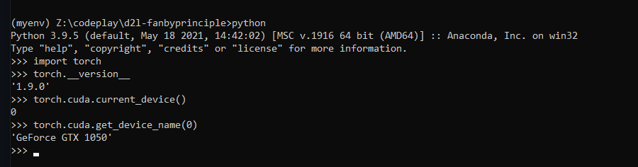

# Dive into Deep Learning book repo

## Installation

https://d2l.ai/chapter_installation/index.html#subsec-gpu

-----

# Ch1 Introduction 

### Types of machine learning

1. Regression

2. Classification

3. Tagging - tagging in medical journels

4. Recommendation systems

5. Search - order matters

6. Sequence learning

7. Unsupervised learning - distributing shift - test and train data sufficiently differ.

### Innovations along the way

1. Dropout

2. arrentionmechanism

3. multi stage designs

4. generative adverserial network

5. parallel computing

## 1.9. Exercises

- Which parts of code that you are currently writing could be “learned”, i.e., improved by learning and automatically determining design choices that are made in your code? Does your code include heuristic design choices?

- I want to make a summary writing tool

- Which problems that you encounter have many examples for how to solve them, yet no specific way to automate them? These may be prime candidates for using deep learning.

- creating speech fakes

- Viewing the development of AI as a new industrial revolution, what is the relationship between algorithms and data? Is it similar to steam engines and coal? What is the fundamental difference?

- more coal more steam, here the quality of data is important

Where else can you apply the end-to-end training approach, such as in Fig. 1.1.2, physics, engineering, and econometrics?

- philosphical experiments

----

# Ch2 Preliminaries

