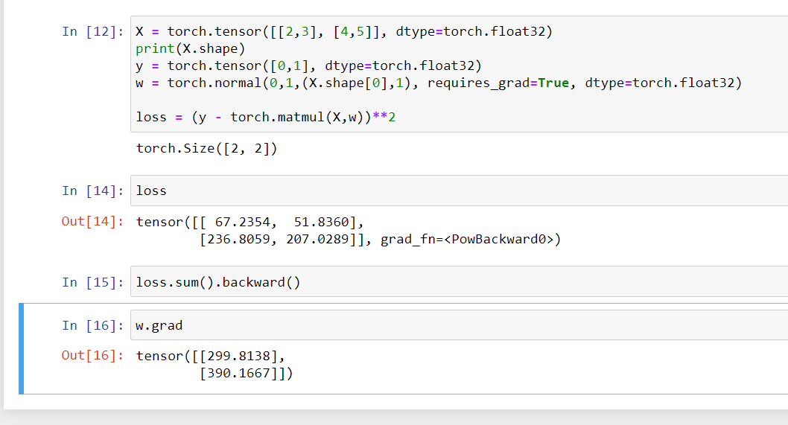

# Linear Neural equations

- Learning simple neural network thorugh linear regression.

## stuff to refer

- log liklihood loss
- basic loss estimation and parameter updation
-  

## Linear regression

- Regression refers to a set of methods for modeling the relationship between one or more independent variables and a dependent variable. In the natural sciences and social sciences, the purpose
of regression is most often to characterize the relationship between the inputs and outputs. Machine learning, on the other hand, is most often concerned with prediction

### Basic elements of linear regression

- prices of houses based on their area , x1 and x2 as inputs and y as output

- linear model - `price = w_area * x1 + w_sq_ft * x2 + b`
 Strictly speaking, (3.1.1) is an affine transformation of input features, which is characterized by a linear transformation of features via weighted sum, combined with a translation via the added bias.

- y_ = W.T * X + b

- Loss function - 1/2 (y - y_)^2 - 
    1/2 is just convenient when we take derivative
    over the entire model we have , 
    1/n (sum(1/2(y-y_)^2))
    = 1/n (sum(1/2(Xw + b - Y)^2))

- we want to find w and b such that we minimise the loss, argmin(L(w,b))

- Analytic solution - 
    1. Linear regression happens to be an unusually simple optimization problem. Unlike most other
    models that we will encounter in this book, linear regression can be solved analytically by applying
    a simple formula. 
    
    2. To start, we can subsume the bias b into the parameter w by appending a column
    to the design matrix consisting of all ones. 
    
    3. Then our prediction problem is to minimize ∥y−Xw∥^2
    
    4. There is just one critical point on the loss surface and it corresponds to the minimum of the loss
    over the entire domain. Taking the derivative of the loss with respect to w and setting it equal to
    zero yields the analytic (closed-form) solution:

    w∗ = (X.⊤ * X)^−1 * X.⊤ * y

- minibatch stochastic gradient descent - 
    1. The key technique for optimizing nearly any deep learning model, and which we will call upon
    throughout this book, consists of iteratively reducing the error by updating the parameters in the
    direction that incrementally lowers the loss function. This algorithm is called gradient descent.

    2. The most naive application of gradient descent consists of taking the derivative of the loss function, which is an average of the losses computed on every single example in the dataset. In practice, this can be extremely slow: we must pass over the entire dataset before making a single
    update. Thus, we will often settle for sampling a random minibatch of examples every time we
    need to compute the update, a variant called minibatch stochastic gradient descent.

    3. In each iteration, we first randomly sample a minibatch B consisting of a fixed number of training
    examples. We then compute the derivative (gradient) of the average loss on the minibatch with
    regard to the model parameters. Finally, we multiply the gradient by a predetermined positive
    value η and subtract the resulting term from the current parameter values.

    4. In short,
    
    (i) we initialize the values of the model parameters, typically at random;
    (ii) we iteratively sample random minibatches from the data,
    updating the parameters in the direction of the negative gradient. For quadratic losses and affine
    transformations, we can write this out explicitly as follows:

    w_updated = w - (learning_rate/mini_batch_size) * sum_over_minibatch((X.w+b - Y)* X)
    b_updated = b - (learning_rate/mini_batch_size) * sum_over_minibatch((X.w + b - Y))

    5. These parameters that are tunable but not updated in the training loop are called hyperparameters

    6. Making predictions -  w_updated.T * x + b_updated

### Vectorization for speed

- drastic increase in efficiency

### Normal distribution and squared loss

- normal distribution can be visualised 
- 1/ root(2 * sigma ^2 * pi) * exp(-1/(2 * sigma ^ 2) * (x - mu)^2)

### log likelihood loss

- One way to motivate linear regression with the mean squared error loss function (or simply
squared loss) is to formally assume that observations arise from noisy observations, where the
noise is normally distributed as follows:
y = w.T *x + b + epsilon which is the normal noise

-predicting liklihood that we can see y when given a y is  -

- 1/root(2 * sigma^2 * pi) * exp(-0.5/ sigma^2 * (y- w.T * X - b)^ 2)

- sigma value doesnt effect log liklihood loss

## Linear regression to deep neural networks

- gives the biological model of neural network

### Exercises

1. Assume that we have some data
∑x1, . . . , xn ∈ R. Our goal is to find a constant b such that (xi − b)2 is minimized.

    1. Find a analytic solution for the optimal value of b.

    * solving for xi = b

    2. How does this problem and its solution relate to the normal distribution?

    * if xi=b then normal equation becomes 1/rootof(2 * pi * sigma^2) * exp(0)  == 1/rootof(2 * pi * sigma^2) 

2. Derive the analytic solution to the optimization problem for linear regression with squared
error. To keep things simple, you can omit the bias b from the problem (we can do this in
principled fashion by adding one column to X consisting of all ones).

    1. Write out the optimization problem in matrix and vector notation (treat all the data as
    a single matrix, and all the target values as a single vector).

    * X = [[2,3],[4,5]] , y = [0,1] 

    2. Compute the gradient of the loss with respect to w.

    * Not really what was asked but -
    

    3. Find the analytic solution by setting the gradient equal to zero and solving the matrix
    equation.

    * The questions subpoint tell you how to do it step wise. we have to minimize || y- Xw ||^2  so differentiating w.r.t w and putting it to zero, we have 2X(y-Xw) = 0, which means = Xy = X.Xw w = (X.X)^-1* Xy.

    

    4. When might this be better than using stochastic gradient descent? When might this
    method break?

    * This method would be good for small datasets, but on larger datasets the cost of storing the entire data in memory and multiplication may be prohibhitive.

3. Assume that the noise model governing the additive noise ϵ is the exponential distribution.
That is, p(ϵ) = 1/2 * exp(−|ϵ|).
    
    1. Write out the negative log-likelihood of the data under the model − log P(y | X).  

    * 1/2 * exp(-|1/root(2 * pi * sigma ^ 2) * exp(-1/(2 * sigma **2) * (x- mu) **2)|) ? what is exponential distribution formula?

    2. Can you find a closed form solution?

    hmm not quite.

    3. Suggest a stochastic gradient descent algorithm to solve this problem. What could possibly go wrong (hint: what happens near the stationary point as we keep on updating the parameters)? Can you fix this?

    Not really know whats going on here.

## Creating linear neural networks from scratch

- creating dataset

- reading the dataset

### Exercises

## Exercises

1. What would happen if we were to initialize the weights to zero. Would the algorithm still work?

It didnt work as grad of zero was not handled.

1. Assume that you are
   [Georg Simon Ohm](https://en.wikipedia.org/wiki/Georg_Ohm) trying to come up
   with a model between voltage and current. Can you use auto differentiation to learn the parameters of your model?

1. Can you use [Planck's Law](https://en.wikipedia.org/wiki/Planck%27s_law) to determine the temperature of an object using spectral energy density?

The formula:

The spectral density comes to be linear because we are not able to update the parameters

1. What are the problems you might encounter if you wanted to  compute the second derivatives? How would you fix them?

vanishing gradients 

1.  Why is the `reshape` function needed in the `squared_loss` function?

so that the predicted y is same shape as that of labels

1. Experiment using different learning rates to find out how fast the loss function value drops.

okay letschange lr

1. If the number of examples cannot be divided by the batch size, what happens to the `data_iter` function's behavior?

then it just caters for reminder of batches

# Concise implementation of Linear regression

### Exercises
1. If we replace nn.MSELoss(reduction='sum') with nn.MSELoss(), how can we change the
learning rate for the code to behave identically. Why?
2. Review the PyTorch documentation to see what loss functions and initialization methods are
provided. Replace the loss by Huberʼs loss.
3. How do you access the gradient of net[0].weight?

in notebook:

## 3.4 Softmax Regression

- Regression is the hammer we reach for when we want to answer how much? or how many? questions. If you want to predict the number of dollars (price) at which a house will be sold, or the
number of wins a baseball team might have, or the number of days that a patient will remain
hospitalized before being discharged, then you are probably looking for a regression model.
In practice, we are more often interested in classification: asking not “how much” but “which one”.

- one hot encoding of labels

- we cannot use output directly because 
    1. probability should sum upto 1
    2. probability should be non negative

- how we achive this is first we take exponential of each logits and then devide by the exponentials

- Vectorisation of mini batches - by creating mini batches we do matrix matrix multiplication instead of matrix vector multiplication we would usually do to sped up operations

- Loss function - 
log liklihood - 

- Softmaxand derivatives - when you take derivative of softmax you find that it is a linear equations as it gives you `y_hat - y` as derivative.

- cross entropy loss -  where labels instead of being 0,1,1 become distributed over a range as (0.1,0.1,0.8) most used for classification problems

### information theory basics 

- deals with transmitting information, decoding and manipulating and encoding

- entropy - quantity is called entropy - H[P ] = sigma(-P(j)) log(P(j))
the unit used is nat, 1/log(2) ~ 1.44 bit

- surprisal - easy to predict meas that it is easy to compress, r if we cannot perfectly predict every event, then we might sometimes be surprised. Our surprise is greater when we assigned an event lower probability. Claude Shannon settled on
log 1 P(j) = − log P(j) to quantify oneʼs surprisal at observing an event j having assigned it a (subjective) probability P(j)

- cross entropy revisited - So if entropy is level of surprise experienced by someone who knows the true probability, then you
might be wondering, what is cross-entropy? The cross-entropy from P to Q, denoted H(P, Q), is
the expected surprisal of an observer with subjective probabilities Q upon seeing data that were
actually generated according to probabilities P. The lowest possible cross-entropy is achieved
when P = Q. In this case, the cross-entropy from P to Q is H(P, P) = H(P).

- cross entropy can be seen as: (i) as maximizing
the likelihood of the observed data; and (ii) as minimizing our surprisal (and thus the number of
bits) required to communicate the labels.

### Exercises

1. We can explore the connection between exponential families and the softmax in some more
depth.
    1. Compute the second derivative of the cross-entropy loss l(y, yˆ) for the softmax.
    2. Compute the variance of the distribution given by softmax(o) and show that it matches
the second derivative computed above.

2. Assume that we have three classes which occur with equal probability, i.e., the probability
vector is 1/3
    1. What is the problem if we try to design a binary code for it?
    2. Can you design a better code? Hint: what happens if we try to encode two independent
observations? What if we encode n observations jointly?

3. Softmax is a misnomer for the mapping introduced above (but everyone in deep learning
uses it). The real softmax is defined as RealSoftMax(a, b) = log(exp(a) + exp(b)).
    1. Prove that RealSoftMax(a, b) > max(a, b).
    2. Prove that this holds for λ
    −1RealSoftMax(λa, λb), provided that λ > 0.
    3. Show that for λ → ∞ we have λ
    −1RealSoftMax(λa, λb) → max(a, b).
    4. What does the soft-min look like?
    5. Extend this to more than two numbers

need to come back toit after i do image recognition

## image recognitiona

- loading data

### exercises

1. Does reducing the batch_size (for instance, to 1) affect the reading performance?

increases

2. The data iterator performance is important. Do you think the current implementation is fast
enough? Explore various options to improve it.

https://stackoverflow.com/questions/61393613/pytorch-speed-up-data-loading

3. Check out the frameworkʼs online API documentation. Which other datasets are available?

## Implementing softmax from scratch

- Recall that in softmax regression, we have as many outputs as there are classes. Because our
dataset has 10 classes, our network will have an output dimension of 10. Consequently, our weights
will constitute a 784 × 10 matrix and the biases will constitute a 1 × 10 row vector. As with linear
regression, we will initialize our weights W with Gaussian noise and our biases to take the initial
value 0.

- discussion on sum function - sum over an axis, if we sum over column then the resultant shape would be of the shape columns.

- in softmax we need to first take the exponenetial and then find the sum of each rows and then devide.

- Cross entropy loss function -takes negative log liklihood of the probablity assigned to true value. 
Recall that cross-entropy takes the negative log-likelihood of the predicted probability assigned to
the true label. Rather than iterating over the predictions with a Python for-loop (which tends to
be inefficient), we can pick all elements by a single operator. Below, we create sample data y_hat
with 2 examples of predicted probabilities over 3 classes and their corresponding labels y. With y
we know that in the first example the first class is the correct prediction and in the second example
the third class is the ground-truth. Using y as the indices of the probabilities in y_hat, we pick the
probability of the first class in the first example and the probability of the third class in the second
example.

- classification accuracy - Given the predicted probability distribution y_hat, we typically choose the class with the highest
predicted probability whenever we must output a hard prediction.

First, if y_hat is a matrix, we assume that the second
dimension stores prediction scores for each class. We use argmax to obtain the predicted class by
the index for the largest entry in each row. Then we compare the predicted class with the groundtruth y elementwise. Since the equality operator == is sensitive to data types, we convert y_hatʼs
data type to match that of y. The result is a tensor containing entries of 0 (false) and 1 (true).
Taking the sum yields the number of correct predictions

- Reevaluate the chapter statring frmthe top.

 

