# Ch 4 multi layer perceptron

- to know about overfitting , underfitting
- regularisation
- creating deep neural networks more than one layer big

# Multi layer perceptron

- Hidden layers - if only one layer of affine solutions is needed for describing the model, then that would be sufficient.
- why activations
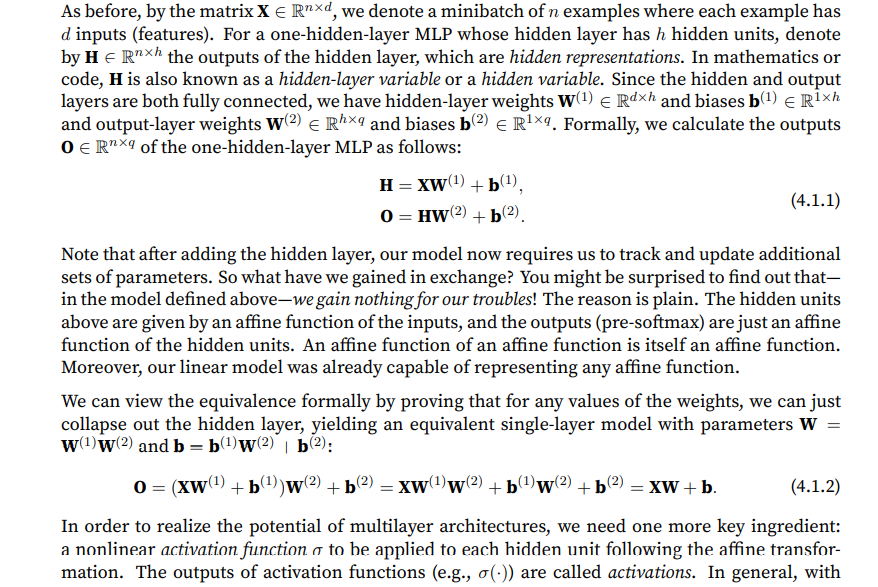

We need activations in between because otherwise the layers would collapse into a linear transformation.

with activations we have,

`H = sigma(XW1 + B1)`
`O = HW2 + B2`

# universal approximators

- a single hidden layer can approximateany function,however in practice we use many hidden layers.
- activation function -
Activation function decides whether a neuron should be activated or not by calculating the weighted sum and adding a bias to it. Differntiable operators that adds nonlinearity.

### Relu activation 

Rectified linear unit, given X, `relu(X) = max(0,X)`

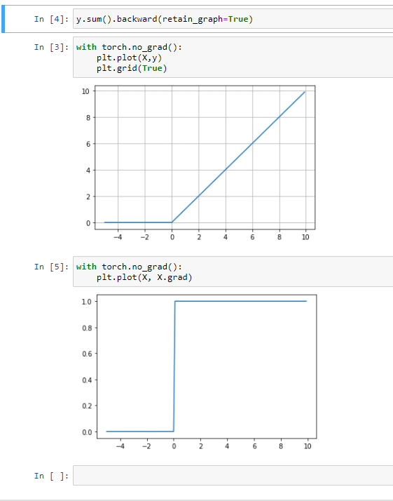

There is also one parameterised relu, `prelu(x) = max(0,x) + alpha * min(0,x) `

Relu has simple derivative function which lets some of th eparameter through or just vanish which is very useful for dealing with problem of vanishing gradients.

### Sigmoid function

- sigmoid function squashes the variable range which lies in between (-inf, inf) to (0,1), thus it is also called squashing function
- `sigmoid(x) = 1/(1 + exp(-x))`

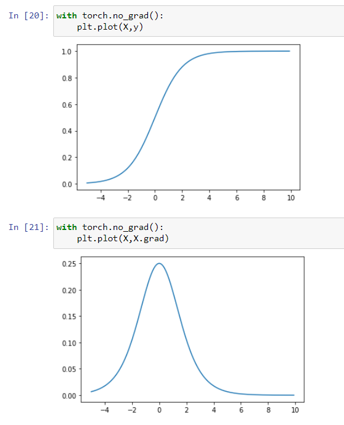


### Tanh function

- This is also a squisher function that squishes the inputs into a range of -1 to 1
- `tanh(x) = 1 - exp(-2x)/ 1 + exp(-2x)`

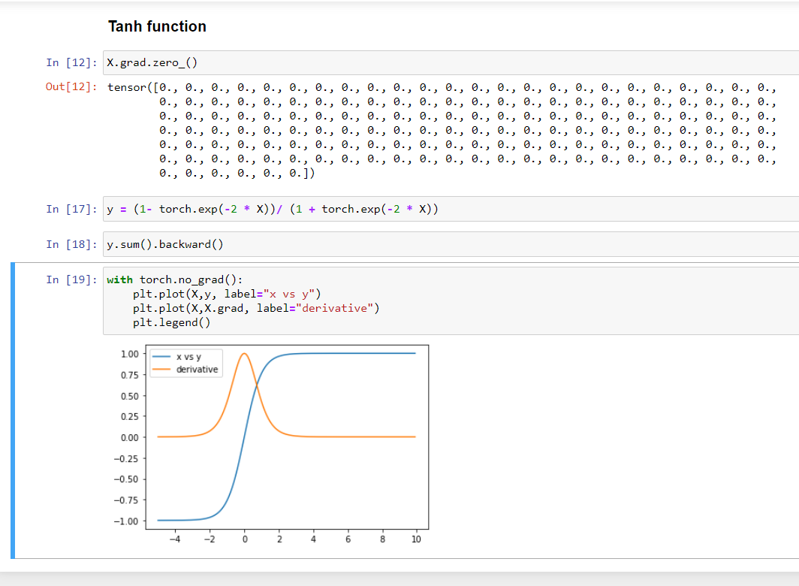

### Exercises

1. Compute the derivative of the pReLU activation function.

* made a way to describe the function but the torch autograd is not able to work

`alpha = 0.1`
`y = find_max(X) + alpha * find_min(X)`

with torch.max the answer:

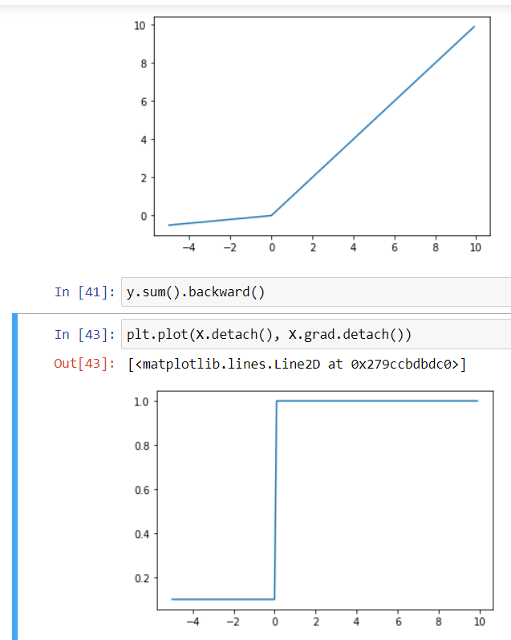

2. Show that an MLP using only ReLU (or pReLU) constructs a continuous piecewise linear
function.

* I guess we need to construct a multi layer perceptron here. dontknow.

3. Show that tanh(x) + 1 = 2 sigmoid(2x).

* through plotting a graph we can show.

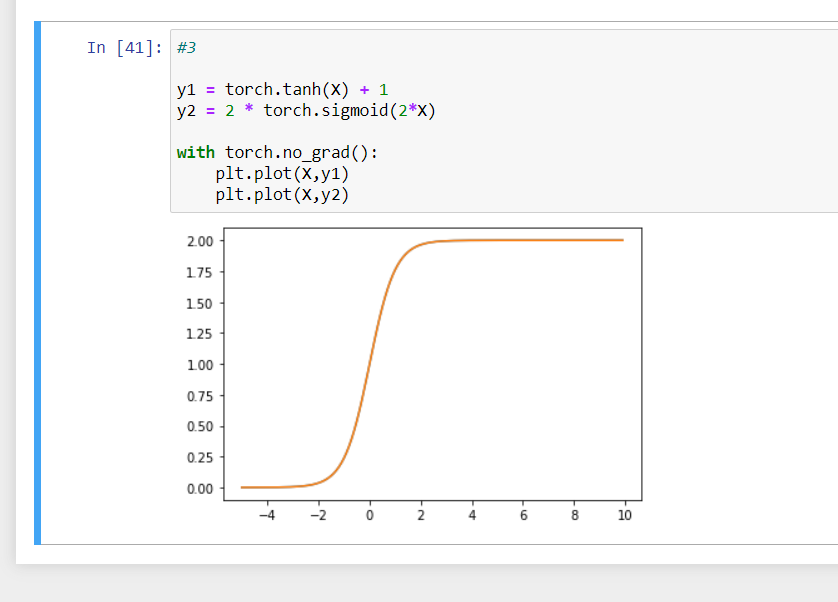

4. Assume that we have a nonlinearity that applies to one minibatch at a time. What kinds of
problems do you expect this to cause?

* maybe this would create problems like each min batch would be squished(scaled) differently.

### Answers from the forums

Question 2:
I think it should be this:

H = Relu(XW^(1) + b^(2))
y = HW^(2) + b^(2)
More detail in page 131.
I think it is more easy to think like this:
Relu(x) constructs a continuous piecewise linear function for every x\in R. So, it do not depend on whatever x is providing that x is continuous in R. So, Relu(Relu(x)*W+b) for example is also constructs a continuous piecewise linear function.

Question 4:
I think the most different between an MLP apply nonlinearity and MLP not apply nonlinearity is the time and complexity. In fact, MLPs applying nonlinearity such as Sigmoid and tanh are very expensive to calculate and find the derivative for gradient descent. So, we need something faster and Relu is a good choice to address these problem (6.x sigmoid).

## Multi layer perceptron

- we will try and define a multi layer percceptron model

mlp prediction

but investigate y_hat size.

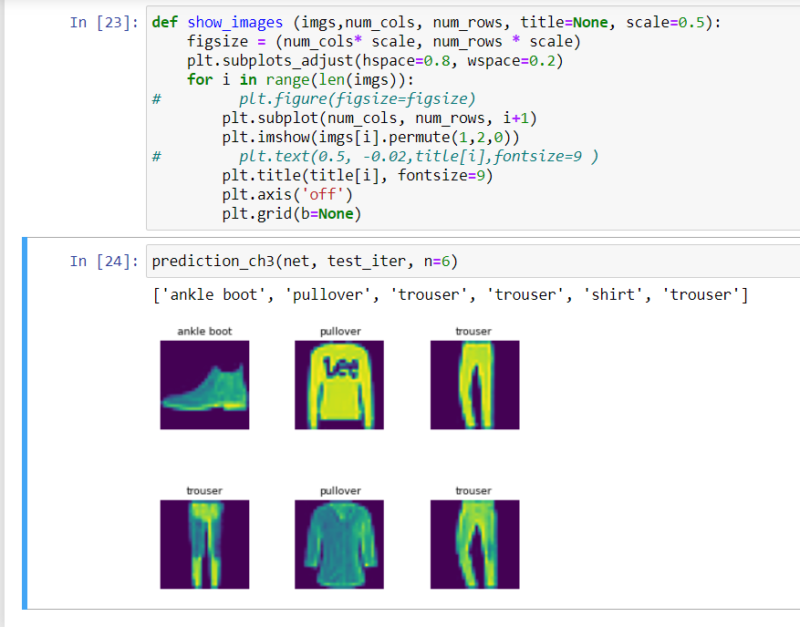

### Exercises
1. Change the value of the hyperparameter num_hiddens and see how this hyperparameter influences your results. Determine the best value of this hyperparameter, keeping all others
constant.

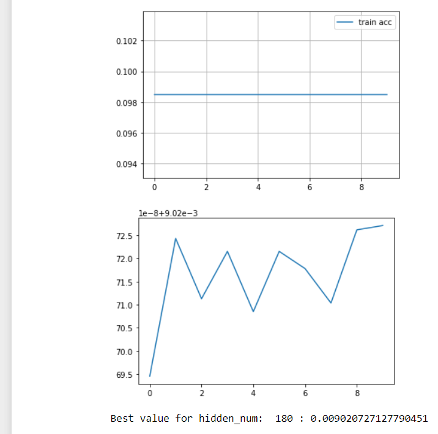


2. Try adding an additional hidden layer to see how it affects the results.

```python
# increasing number of hidden layers

W1 = nn.Parameter(torch.randn(num_inputs, 128) * 0.01,requires_grad=True)
b1 = nn.Parameter(torch.zeros(128),requires_grad=True)
W2 = nn.Parameter(torch.randn(128, 64) * 0.01, requires_grad=True)
b2 = nn.Parameter(torch.zeros(64), requires_grad=True)
W3 = nn.Parameter(torch.randn(64,num_outputs)*0.01, requires_grad=True)
b3 = nn.Parameter(torch.zeros(num_outputs),requires_grad=True)

def net(X):
    X=X.reshape(-1,num_inputs)
    out = relu(torch.matmul(X,W1) + b1)
    out = relu(torch.matmul(out,W2)+b2)
    return torch.matmul(out,W3) + b3
```

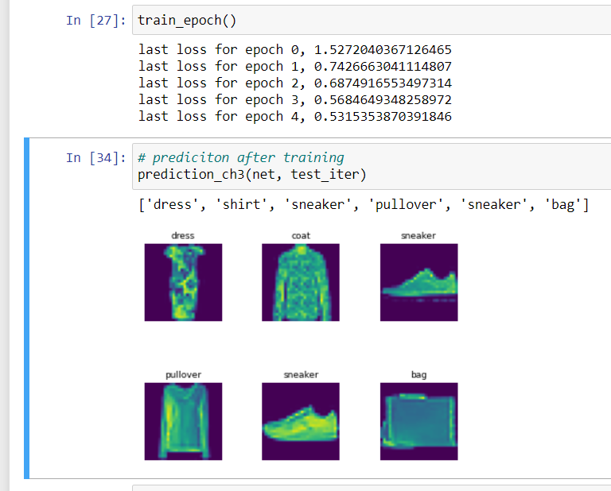

3. How does changing the learning rate alter your results? Fixing the model architecture and
other hyperparameters (including number of epochs), what learning rate gives you the best
results?

* changes the rate of convergence

4. What is the best result you can get by optimizing over all the hyperparameters (learning rate,
number of epochs, number of hidden layers, number of hidden units per layer) jointly?

*  loss of 0.5

5. Describe why it is much more challenging to deal with multiple hyperparameters.

* combinatorial explosion because of more combination of hyperparameters

6. What is the smartest strategy you can think of for structuring a search over multiple hyperparameters?

* creating a matrices of all parameters and then optimally training over the combinationto find the result. some heuristic may be required.

## Concise Multi layer perceptron

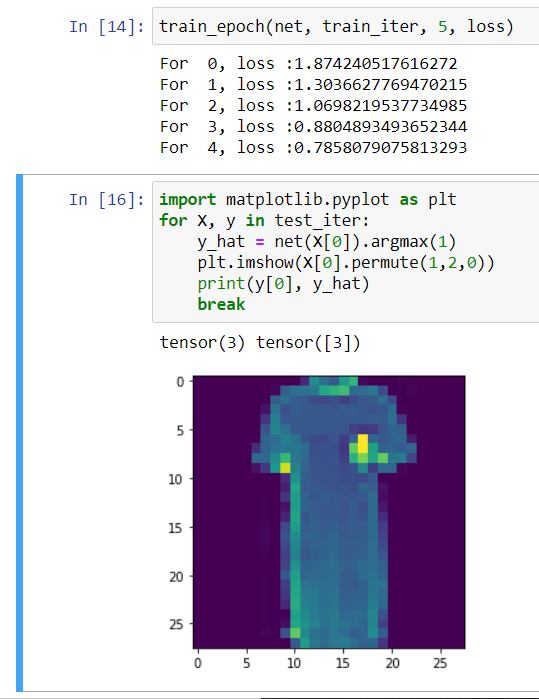

### Exercises
1. Try adding different numbers of hidden layers (you may also modify the learning rate). What
setting works best?

* it worked for me by just adding one more layer , and with SGD best earning rate was 0.1

2. Try out different activation functions. Which one works best?

* I tried ADAM but shd was the best activation.

3. Try different schemes for initializing the weights. What method works best?

* tried putting all linear layers to zero, but normal initialisation works best

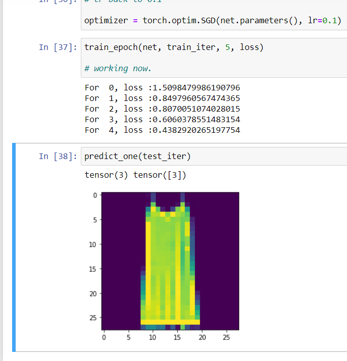

## Model selection, Underfitting overfitting

- points to consider, memorising data is not good, space requirements make it infeasible, generalisationofafair cointoss if taken enough sample would always be 1/2. if its not then there is sampling bias.

- however model shouldnt be too generalised so as to catch onto spurious patterns

- more the number of tunable parameter more the tendency to overfit

- if more the range of value takenbu parameters more the case of overfitting

- the number of taining examples if less

- after model complexity ,model selection is important

- Validation dataset

- K fold validation -model is split into K subsets. And each time validation is done on the subset its not trained on. Validation error then is the average over K subsets.

- If validation and training error both are high, with a little gap between them it means we are undergitting. Our model is too simple. If training error is severly lower than validation error , it means we are overfitting.

- Dataset size -more data means morecomplex model.More data never hurts generally.

## Polynomial Regression

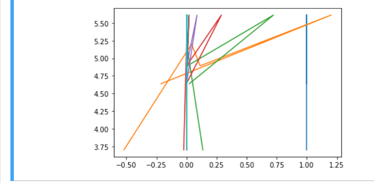

### Demonstrating fit :

1. 3 variable normal fitting.

- errors I encountered, changing type of tensor using `torch.type`
- using `cross entropy loss` to do regresssion instead of `MSELoss`

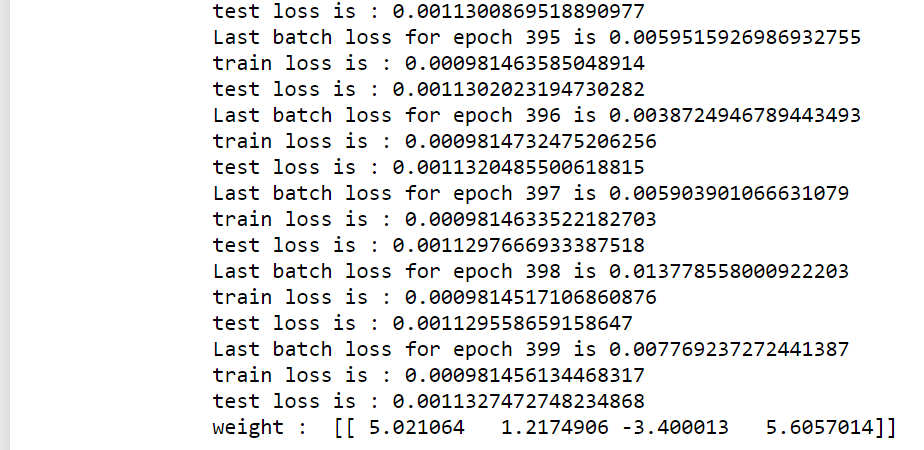


the graph:

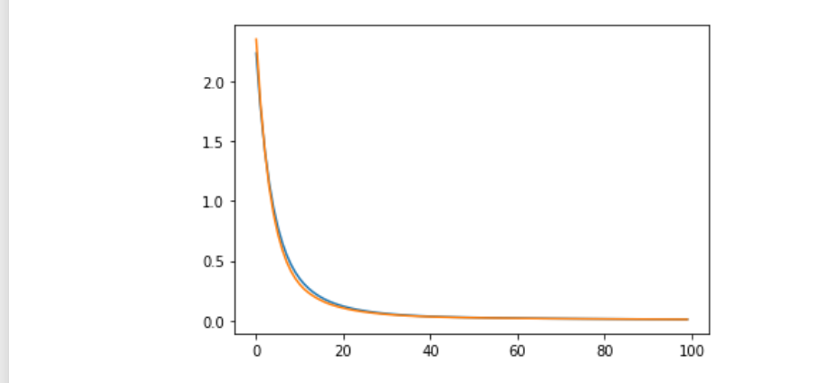

2. Creating a linear function. Underfitting.

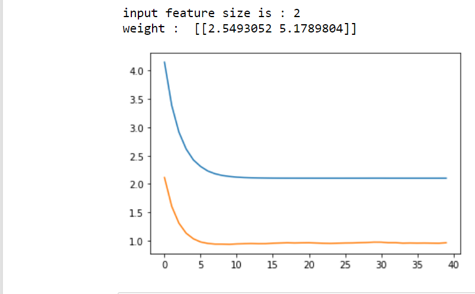

3. Overfitting a linear function

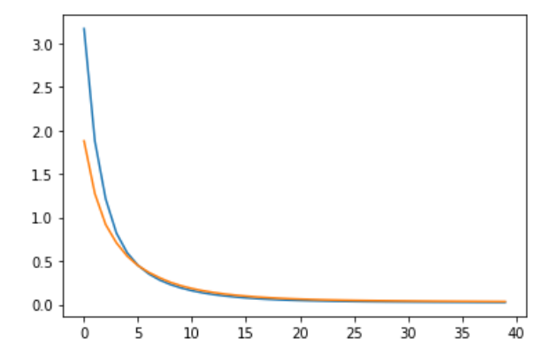

### Exercises

1. Can you solve the polynomial regression problem exactly? Hint: use linear algebra.

* dont know how to do it. exactly.

2. Consider model selection for polynomials:
    1. Plot the training loss vs. model complexity (degree of the polynomial). What do you
    observe? What degree of polynomial do you need to reduce the training loss to 0?

    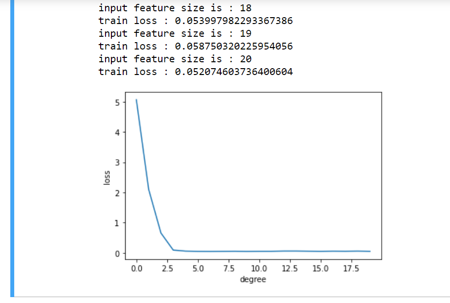

    at about 5 degree it becomes zero.

    2. Plot the test loss in this case.
    
    3. Generate the same plot as a function of the amount of data.

* my graphs- 

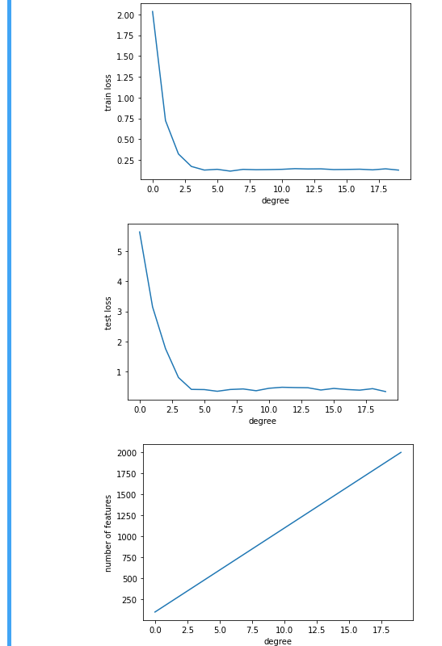

3. What happens if you drop the normalization (1/i!) of the polynomial features x
i
? Can you
fix this in some other way?

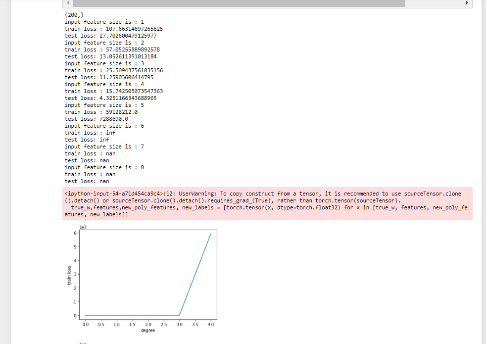

* Maybe we can put our own normalisation feature mechanism, though I am not sure.

4. Can you ever expect to see zero generalization error?

* only when the environment conditions are fully known.


