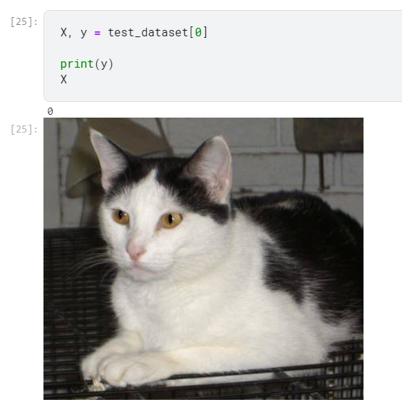

# Ch 4 multi layer perceptron

- to know about overfitting , underfitting
- regularisation
- creating deep neural networks more than one layer big

# Multi layer perceptron

- Hidden layers - if only one layer of affine solutions is needed for describing the model, then that would be sufficient.
- why activations


We need activations in between because otherwise the layers would collapse into a linear transformation.

with activations we have,

`H = sigma(XW1 + B1)`
`O = HW2 + B2`

# universal approximators

- a single hidden layer can approximateany function,however in practice we use many hidden layers.
- activation function -
Activation function decides whether a neuron should be activated or not by calculating the weighted sum and adding a bias to it. Differntiable operators that adds nonlinearity.

### Relu activation 

Rectified linear unit, given X, `relu(X) = max(0,X)`


There is also one parameterised relu, `prelu(x) = max(0,x) + alpha * min(0,x) `

Relu has simple derivative function which lets some of th eparameter through or just vanish which is very useful for dealing with problem of vanishing gradients.

### Sigmoid function

- sigmoid function squashes the variable range which lies in between (-inf, inf) to (0,1), thus it is also called squashing function
- `sigmoid(x) = 1/(1 + exp(-x))`


### Tanh function

- This is also a squisher function that squishes the inputs into a range of -1 to 1
- `tanh(x) = 1 - exp(-2x)/ 1 + exp(-2x)`


### Exercises

1. Compute the derivative of the pReLU activation function.

* made a way to describe the function but the torch autograd is not able to work

`alpha = 0.1`
`y = find_max(X) + alpha * find_min(X)`

with torch.max the answer:


2. Show that an MLP using only ReLU (or pReLU) constructs a continuous piecewise linear
function.

* I guess we need to construct a multi layer perceptron here. dontknow.

3. Show that tanh(x) + 1 = 2 sigmoid(2x).

* through plotting a graph we can show.


4. Assume that we have a nonlinearity that applies to one minibatch at a time. What kinds of
problems do you expect this to cause?

* maybe this would create problems like each min batch would be squished(scaled) differently.

### Answers from the forums

Question 2:
I think it should be this:

H = Relu(XW^(1) + b^(2))
y = HW^(2) + b^(2)
More detail in page 131.
I think it is more easy to think like this:
Relu(x) constructs a continuous piecewise linear function for every x\in R. So, it do not depend on whatever x is providing that x is continuous in R. So, Relu(Relu(x)*W+b) for example is also constructs a continuous piecewise linear function.

Question 4:
I think the most different between an MLP apply nonlinearity and MLP not apply nonlinearity is the time and complexity. In fact, MLPs applying nonlinearity such as Sigmoid and tanh are very expensive to calculate and find the derivative for gradient descent. So, we need something faster and Relu is a good choice to address these problem (6.x sigmoid).

## Multi layer perceptron

- we will try and define a multi layer percceptron model

mlp prediction

but investigate y_hat size.


### Exercises
1. Change the value of the hyperparameter num_hiddens and see how this hyperparameter influences your results. Determine the best value of this hyperparameter, keeping all others
constant.


2. Try adding an additional hidden layer to see how it affects the results.

```python
# increasing number of hidden layers

W1 = nn.Parameter(torch.randn(num_inputs, 128) * 0.01,requires_grad=True)
b1 = nn.Parameter(torch.zeros(128),requires_grad=True)
W2 = nn.Parameter(torch.randn(128, 64) * 0.01, requires_grad=True)
b2 = nn.Parameter(torch.zeros(64), requires_grad=True)
W3 = nn.Parameter(torch.randn(64,num_outputs)*0.01, requires_grad=True)
b3 = nn.Parameter(torch.zeros(num_outputs),requires_grad=True)

def net(X):
    X=X.reshape(-1,num_inputs)
    out = relu(torch.matmul(X,W1) + b1)
    out = relu(torch.matmul(out,W2)+b2)
    return torch.matmul(out,W3) + b3
```


3. How does changing the learning rate alter your results? Fixing the model architecture and
other hyperparameters (including number of epochs), what learning rate gives you the best
results?

* changes the rate of convergence

4. What is the best result you can get by optimizing over all the hyperparameters (learning rate,
number of epochs, number of hidden layers, number of hidden units per layer) jointly?

*  loss of 0.5

5. Describe why it is much more challenging to deal with multiple hyperparameters.

* combinatorial explosion because of more combination of hyperparameters

6. What is the smartest strategy you can think of for structuring a search over multiple hyperparameters?

* creating a matrices of all parameters and then optimally training over the combinationto find the result. some heuristic may be required.

## Concise Multi layer perceptron


### Exercises
1. Try adding different numbers of hidden layers (you may also modify the learning rate). What
setting works best?

* it worked for me by just adding one more layer , and with SGD best earning rate was 0.1

2. Try out different activation functions. Which one works best?

* I tried ADAM but shd was the best activation.

3. Try different schemes for initializing the weights. What method works best?

* tried putting all linear layers to zero, but normal initialisation works best


## Model selection, Underfitting overfitting

- points to consider, memorising data is not good, space requirements make it infeasible, generalisationofafair cointoss if taken enough sample would always be 1/2. if its not then there is sampling bias.

- however model shouldnt be too generalised so as to catch onto spurious patterns

- more the number of tunable parameter more the tendency to overfit

- if more the range of value takenbu parameters more the case of overfitting

- the number of taining examples if less

- after model complexity ,model selection is important

- Validation dataset

- K fold validation -model is split into K subsets. And each time validation is done on the subset its not trained on. Validation error then is the average over K subsets.

- If validation and training error both are high, with a little gap between them it means we are undergitting. Our model is too simple. If training error is severly lower than validation error , it means we are overfitting.

- Dataset size -more data means morecomplex model.More data never hurts generally.

## Polynomial Regression


### Demonstrating fit :

1. 3 variable normal fitting.

- errors I encountered, changing type of tensor using `torch.type`
- using `cross entropy loss` to do regresssion instead of `MSELoss`


the graph:


2. Creating a linear function. Underfitting.


3. Overfitting a linear function


### Exercises

1. Can you solve the polynomial regression problem exactly? Hint: use linear algebra.

* dont know how to do it. exactly.

2. Consider model selection for polynomials:
    1. Plot the training loss vs. model complexity (degree of the polynomial). What do you
    observe? What degree of polynomial do you need to reduce the training loss to 0?

    

    at about 5 degree it becomes zero.

    2. Plot the test loss in this case.
    
    3. Generate the same plot as a function of the amount of data.

* my graphs- 


3. What happens if you drop the normalization (1/i!) of the polynomial features x
i
? Can you
fix this in some other way?


* Maybe we can put our own normalisation feature mechanism, though I am not sure.

4. Can you ever expect to see zero generalization error?

* only when the environment conditions are fully known.

## Weight decay

- Is a way for mitigating overfitting.
- removing features may turn out ot be costly to avoid overfitting.
- We need a way to deal with function gradients
- Weightdecay is l2regularisation, we add the norm as a penalising factor to the loss function
- in this case l2 means ||w||^2 multiplied bya regularisation parameter lambda/2
- if lambda=0 there is no regularisation, if >0 there is
- l1 regularisation is lasso regularisation, l2 regularisation is ridge regularisation
- l1 penalties lead to model creation from small number of parameters while l2 punished big weights in all parameters
- since we not only update the weight we also try to bring it closer to zero in l2 regularisation thats why it is known as weight decay.
- w <- (1-eta * lambda ) w - eta/batch_size * gradient of loss
here , gradient of loss being  sum over btach(x )* sum over batch(w.T * x + b - y)

### High dimensional linear regression

Using linear regression on weight decay we have implementation from scratch:


However when we use the default weight decay using SGD we get better result


### Exercises

1. Experiment with the value of λ in the estimation problem in this section. Plot training and
test accuracy as a function of λ. What do you observe?

* as we increase wd it is making better train and test loss graph


2. Use a validation set to find the optimal value of λ. Is it really the optimal value? Does this
matter?

* the minimum loss is 0.02 at wd = 21-5 = 16. It is th eoptimal value for the validation set.


3. What would the update equations look like if instead of ∥w∥
2 we used ∑
i
|wi
| as our penalty
of choice (L1 regularization)?

* It is strangely coming as linear

```python
# training for l1 norm
model = nn.Sequential(nn.Linear(num_inputs, 1))

for param in model.parameters():
    param.data.normal_()
    print(l1_norm(param.detach()))
    
loss = nn.MSELoss()

optimizer = torch.optim.SGD(model.parameters(), lr = 0.03)

valid_loss_array = []
for epoch in range(20):
    current_loss = 0
    current_number = 0
    for X, y in valid_dataloader:
        l = loss(model(X),y) - l1_norm_with_abs(model[0].weight)
        
        optimizer.zero_grad()
        l.backward()
        optimizer.step()
        
        current_loss += l.detach()
        current_number += len(y)
    
    valid_loss_array.append(current_loss/current_number)

plt.plot(range(20), valid_loss_array)
plt.grid(True)
plt.show()

```


4. We know that ∥w∥
2 = w⊤w. Can you find a similar equation for matrices (see the Frobenius
norm in Section 2.3.10)?

* This is Frobenius norm: f(αx) = |α|f(x).  I dont understand.

5. Review the relationship between training error and generalization error. In addition to
weight decay, increased training, and the use of a model of suitable complexity, what other
ways can you think of to deal with overfitting?

* larger data size, dropouts

6. In Bayesian statistics we use the product of prior and likelihood to arrive at a posterior via
P(w | x) ∝ P(x | w)P(w). How can you identify P(w) with regularization?

* you ask good question but me no understand. how to get to p of w.

## Dropout

- Overfitting revisited - with overfitting, if you have more examples thatn features youll not overfit generally.
- bias variance tradeoff - chooseing between flexibility and generalisation, like linear models have higher bias they can representonly a small number of functions, however the variance is less.

- Neural network on th eother hand have a tendency to find associations between the features.

- in 1995, Christopher bishop showed that adding noise was going to add regularisation, this idea was adopted by Srivastava et al in 2014 for creating dropout

- standard dropout means zeroing someof the inputs at each layer. it was meant to break the coadaptation.

- originally by bishop ateach training iteration, headded agauusian normal noise, but in dropout, in dropout the activation is replaced by either 0 or h/ 1-p

- we generally dont apply dropout over testing data, unless we need to use it as a heuristic to measure how confident the model is.

### Creating a dropout based prediction model from scratch


### Creating a concise model


### Exercises

1. What happens if you change the dropout probabilities for the first and second layers? In
particular, what happens if you switch the ones for both layers? Design an experiment to
answer these questions, describe your results quantitatively, and summarize the qualitative
takeaways.

* Nothing much changes based on the final accuracy to compare. 


2. Increase the number of epochs and compare the results obtained when using dropout with
those when not using it.

* there is a significant difference in loss. Iam getting comparative results in both.


3. What is the variance of the activations in each hidden layer when dropout is and is not applied? Draw a plot to show how this quantity evolves over time for both models.

* What is meant by variance here do we just apply torch.var over the net.linear weight layers? thisis the graph I came up with.


4. Why is dropout not typically used at test time?

* Because we would like all the features weights to be useful and consequential to making the prediction.

5. Using the model in this section as an example, compare the effects of using dropout and
weight decay. What happens when dropout and weight decay are used at the same time?
Are the results additive? Are there diminished returns (or worse)? Do they cancel each other
out?

* The returns are diminished when using both, compared to using them individually.


6. What happens if we apply dropout to the individual weights of the weight matrix rather than
the activations?

* it is still training. But with some slight oscillation in loss. This is the forward implementation
 ```python
  def forward(self, X):
        out = self.lin1(X.reshape(-1,784))
        out = dropout_layer(out, self.dropout1)
        out = self.relu(out)
        out = self.lin2(out)
        out = dropout_layer(out, self.dropout2)
        out = self.relu(out)
        out = self.lin3(out)

        return out
        
 ```


7. Invent another technique for injecting random noise at each layer that is different from the
standard dropout technique. Can you develop a method that outperforms dropout on the
Fashion-MNIST dataset (for a fixed architecture)?

* I propose to add noise after each hidden layer.

```python
class net_epsilon(nn.Module):
    def __init__(self, num_inputs=784, num_outputs=10, num_hidden1=256, num_hidden2=256, epsilon_m=0.02, epsilon_d=0.02):
        super(net_epsilon, self).__init__()
        self.lin1 = nn.Linear(num_inputs, num_hidden1)
        self.lin2 = nn.Linear(num_hidden1, num_hidden2)
        self.lin3 = nn.Linear(num_hidden2, num_outputs)
        self.relu = nn.ReLU()
        self.epsilon_m = epsilon_m
        self.epsilon_d = epsilon_d
        self.num_inputs = num_inputs
    
    def forward(self, X):
        out = self.relu(self.lin1(X.reshape(-1,self.num_inputs)))
        out = out + torch.normal(self.epsilon_m, self.epsilon_d, (out.shape))
        out = self.relu(self.lin2(X.reshape(-1, self.num_inputs)))
        out = out + torch.normal(self.epsilon_m, self.epsilon_d, (out.shape))
        out = self.lin3(out)
```


## Forward propagation, backpropogation and computational graphs

- so far we only cared about forward propagation preferring tohandle back proagationthrough grad function in pytorch.

### Forward propagation

- Forward propogation is nothing but multiplying th eweights with features putting it thorugh an activation function and then figuring out loss, comparing it with base truth.

### Computational graph with forward propagation

- computational graphshows the relationship of various operator and operands.

### Backpropagation

- Backpropagation refers to the method of calculating the gradient of neural network parameters.
- method traverses  in reverse order from output to input
- given Y = f(X) and Z = g(Y) then the algorithm calculates dZ/dX = dZ/dY * dY/DX
- more to come here

### Exercises

1. Assume that the inputs X to some scalar function f are n × m matrices. What is the dimensionality of the gradient of f with respect to X?

* Dimensionality reamains the same I tried be look at X.grad values.


2. Add a bias to the hidden layer of the model described in this section (you do not need to
include bias in the regularization term).
1. Draw the corresponding computational graph.
2. Derive the forward and backward propagation equations.

* given in the pic. There is almost no change.


3. Compute the memory footprint for training and prediction in the model described in this
section.

* If we are to assume that X belongs to R^d then , you would need to store dl/do, dh/dz, X, lambda, W(1), W(2), h, X.grad so considering X size is d then 4d + 4. Based on gradients calculated above. Rest all can be derived.

4. Assume that you want to compute second derivatives. What happens to the computational
graph? How long do you expect the calculation to take?

* dont know how to come up with a solution to this

5. Assume that the computational graph is too large for your GPU.
    1. Can you partition it over more than one GPU?

    * maybe computational grapha can be devided but there needs to be tmiing pipeline else one part would wait for the other. Maybe different batchwise the multiple GPU can be recruited.

    2. What are the advantages and disadvantages over training on a smaller minibatch?

    * smaller minibatch takes more time and less memory and vice versa. Its a time space tradeoff.

My question now is what does X.grad give you what is that computation?

Conceptually, autograd records a graph recording all of the operations that created the data as you execute operations, giving you a directed acyclic graph whose leaves are the input tensors and roots are the output tensors. By tracing this graph from roots to leaves, you can automatically compute the gradients using the chain rule.

## Numerical stability and initialisation

- The choice of initialisaition and the choice ofnon linear function is especially important lest it leads us to exploding or vanishing gradients.

### Vanishing and exploding gradients

- since we havea depp neural network we would have have multiplelayers of of activation to deal with , if h(l) = f(h(l-1)) when we derive the derivative d/dl*(h(l)) it would be W(h) * h(l-1)-> similarly for rest soit eventually become a product of all the layer weights, if the weights are too small then it creates vanishing gradient problem if too large then exploding gradient.

- Sigmoid activation and problem of vanishing gradients.


if the weights as=re too large or too small sigmoid vanishes.

- if too large then also goesto infinity.


- breaking the symmetry.
with same initialisation it might happenthat both hidden network getactivated in the same way, thus making multiple layers redundant.

### Parameter initialisation 

-  Default initialisation - either the system will initialise on its own or using normal initialisation.

- Xavier initialisation -  we know that o = sumof(w*x)
now if we take mean to be zero and variance to gamma^2 then, E(o) = sum of (E(w) E(x)) since x =0 => E(o) 0

- similarly var (o) = E(o^2) - E(o)^2 = E(o^2) = E(w^2x^2) =  n * sigma^2 * gamma^2

if we take n * sigma^2  = 1 then, taking similar condition for outpt we have, 1/2* (nin + nout) ^2 * sigma^2 = 1 => sgma = dq_root((2/nin + nout)^2)

Note that the uniform distribution $U(-a, a)$ has variance $\frac{a^2}{3}$.
Plugging $\frac{a^2}{3}$ into our condition on $\sigma^2$
yields the suggestion to initialize according to

$$U\left(-\sqrt{\frac{6}{n_\mathrm{in} + n_\mathrm{out}}}, \sqrt{\frac{6}{n_\mathrm{in} + n_\mathrm{out}}}\right).$$


### Exercises

1. Can you design other cases where a neural network might exhibit symmetry requiring breaking besides the permutation symmetry in an MLP's layers?

* loss and regularisation 

1. Can we initialize all weight parameters in linear regression or in softmax regression to the same value?

* We can try it but it may lead to symmetry condition

1. Look up analytic bounds on the eigenvalues of the product of two matrices. What does this tell you about ensuring that gradients are well conditioned?

* The largest eigenvalue of such a matrix (symmetric) is equal to the matrix norm. Say your two matrices are A and B.

∥AB∥≤∥A∥∥B∥=λ1,Aλ1,B

where λ1,A is the largest eigenvalue of A and λ1,B is the largest eigenvalue of B. So the largest eigenvalue of the product is upper-bounded by the product of the largest eigenvalues of the two matrices. For a proof of what I just asserted, see: Norm of a symmetric matrix equals spectral radius

In terms of the smallest, it looks like the product of the smallest two eigenvalues also gives you a lower bound on the smallest eigenvalue of the product. For a complete reference on how the eigenvalues are related, see: https://mathoverflow.net/questions/106191/eigenvalues-of-product-of-two-symmetric-matrices

* Condition number (l) = max value of eigen value divided by min value of eigen value.
If l >> 1 then it we say it is ill-conditioned
If l approx = 1 the well-conditioned.

1. If we know that some terms diverge, can we fix this after the fact? Look at the paper on layerwise adaptive rate scaling  for inspiration :cite:`You.Gitman.Ginsburg.2017`.

* LARS uses seperate learning rate for each layer.

## Environment and distribution shift

- How the test environment changes the usabilityof model. Test conditions are drastically different thatn the trial conditions that we are notmally used to.

### Types of distribution shift

- what if the distribution is the same but the labels flip

- covariate shift ? the test images are drastically different than the train data. for example the training data consisted of images of cats and dogs while the test data consisted of images ofcartoons that are cats and dogs.

- label shift - as in the labels will change. But in deep learning its better to assume label change because they are low dimensional

- concept shift - the concept of soft drink varies accross time and geopgraphy therefore labels though themmselves maynot change bbut the meaning of labels might.

### examples were the shift affected

- Medical diagnostics - if the client gets data from different age groups then it wont help matters as they have different metabolism, activity, hormonla secretion etc.

- self driving cars - if you use game simulated environment,you cannot apply it on real valued data it just does not work as the shading would be difficult.

- Non stationary distributions - where the model works perfectly now but overtime due to lack of updation it doesn't live up to what it was supposed to do.

- image classifier trained on perfect data may not produce good result because in real life he distribution is different.

### Correction and distribution shift

- Empirical risk and risk

Empirical risk is avaerage loss over training data

1/n for all n (l(f(x),y))

while risk is the expectation of loss over entire training data, since we cannot minimize the risk as the entire population is not available we would rather minimise the empirical risk.

E(empirical risk) = 

$$E_{p(\mathbf{x}, y)} [l(f(\mathbf{x}), y)] = \int\int l(f(\mathbf{x}), y) p(\mathbf{x}, y) \;d\mathbf{x}dy.$$
:eqlabel:`eq_true-risk`

- covariate shift correction -

Assume that we want to estimate
some dependency $P(y \mid \mathbf{x})$
for which we have labeled data $(\mathbf{x}_i, y_i)$.
Unfortunately, the observations $\mathbf{x}_i$ are drawn
from some *source distribution* $q(\mathbf{x})$
rather than the *target distribution* $p(\mathbf{x})$.
Fortunately,
the dependency assumption means
that the conditional distribution does not change: $p(y \mid \mathbf{x}) = q(y \mid \mathbf{x})$.
If the source distribution $q(\mathbf{x})$ is "wrong",
we can correct for that by using the following simple identity in the risk:

$$
\begin{aligned}
\int\int l(f(\mathbf{x}), y) p(y \mid \mathbf{x})p(\mathbf{x}) \;d\mathbf{x}dy =
\int\int l(f(\mathbf{x}), y) q(y \mid \mathbf{x})q(\mathbf{x})\frac{p(\mathbf{x})}{q(\mathbf{x})} \;d\mathbf{x}dy.
\end{aligned}
$$

In other words, we need to reweigh each data example
by the ratio of the
probability
that it would have been drawn from the correct distribution to that from the wrong one:

$$\beta_i \stackrel{\mathrm{def}}{=} \frac{p(\mathbf{x}_i)}{q(\mathbf{x}_i)}.$$

Plugging in the weight $\beta_i$ for
each data example $(\mathbf{x}_i, y_i)$
we can train our model using
*weighted empirical risk minimization*:

$$\mathop{\mathrm{minimize}}_f \frac{1}{n} \sum_{i=1}^n \beta_i l(f(\mathbf{x}_i), y_i).$$
:eqlabel:`eq_weighted-empirical-risk-min`


Alas, we do not know that ratio,
so before we can do anything useful we need to estimate it.

Many methods are available,
including some fancy operator-theoretic approaches
that attempt to recalibrate the expectation operator directly
using a minimum-norm or a maximum entropy principle.
Note that for any such approach, we need samples
drawn from both distributions---the "true" $p$, e.g.,
by access to test data, and the one used
for generating the training set $q$ (the latter is trivially available).
Note however, that we only need features $\mathbf{x} \sim p(\mathbf{x})$;
we do not need to access labels $y \sim p(y)$.

In this case, there exists a very effective approach
that will give almost as good results as the original: logistic regression,
which is a special case of softmax regression (see :numref:`sec_softmax`)
for binary classification.
This is all that is needed to compute estimated probability ratios.
We learn a classifier to distinguish
between data drawn from $p(\mathbf{x})$
and data drawn from $q(\mathbf{x})$.
If it is impossible to distinguish
between the two distributions
then it means that the associated instances
are equally likely to come from
either one of the two distributions.
On the other hand, any instances
that can be well discriminated
should be significantly overweighted
or underweighted accordingly.

For simplicity's sake assume that we have
an equal number of instances from both distributions
$p(\mathbf{x})$
and $q(\mathbf{x})$, respectively.
Now denote by $z$ labels that are $1$
for data drawn from $p$ and $-1$ for data drawn from $q$.
Then the probability in a mixed dataset is given by

$$P(z=1 \mid \mathbf{x}) = \frac{p(\mathbf{x})}{p(\mathbf{x})+q(\mathbf{x})} \text{ and hence } \frac{P(z=1 \mid \mathbf{x})}{P(z=-1 \mid \mathbf{x})} = \frac{p(\mathbf{x})}{q(\mathbf{x})}.$$

Thus, if we use a logistic regression approach,
where $P(z=1 \mid \mathbf{x})=\frac{1}{1+\exp(-h(\mathbf{x}))}$ ($h$ is a parameterized function),
it follows that

$$
\beta_i = \frac{1/(1 + \exp(-h(\mathbf{x}_i)))}{\exp(-h(\mathbf{x}_i))/(1 + \exp(-h(\mathbf{x}_i)))} = \exp(h(\mathbf{x}_i)).
$$

As a result, we need to solve two problems:
first one to distinguish between
data drawn from both distributions,
and then a weighted empirical risk minimization problem
in :eqref:`eq_weighted-empirical-risk-min`
where we weigh terms by $\beta_i$.

Now we are ready to describe a correction algorithm.
Suppose that we have a training set $\{(\mathbf{x}_1, y_1), \ldots, (\mathbf{x}_n, y_n)\}$ and an unlabeled test set $\{\mathbf{u}_1, \ldots, \mathbf{u}_m\}$.
For covariate shift,
we assume that $\mathbf{x}_i$ for all $1 \leq i \leq n$ are drawn from some source distribution
and $\mathbf{u}_i$ for all $1 \leq i \leq m$
are drawn from the target distribution.
Here is a prototypical algorithm
for correcting covariate shift:

1. Generate a binary-classification training set: $\{(\mathbf{x}_1, -1), \ldots, (\mathbf{x}_n, -1), (\mathbf{u}_1, 1), \ldots, (\mathbf{u}_m, 1)\}$.
1. Train a binary classifier using logistic regression to get function $h$.
1. Weigh training data using $\beta_i = \exp(h(\mathbf{x}_i))$ or better $\beta_i = \min(\exp(h(\mathbf{x}_i)), c)$ for some constant $c$.
1. Use weights $\beta_i$ for training on $\{(\mathbf{x}_1, y_1), \ldots, (\mathbf{x}_n, y_n)\}$ in :eqref:`eq_weighted-empirical-risk-min`.

Note that the above algorithm relies on a crucial assumption.
For this scheme to work, we need that each data example
in the target (e.g., test time) distribution
had nonzero probability of occurring at training time.
If we find a point where $p(\mathbf{x}) > 0$ but $q(\mathbf{x}) = 0$,
then the corresponding importance weight should be infinity.


### Label Shift Correction

Assume that we are dealing with a
classification task with $k$ categories.
Using the same notation in :numref:`subsec_covariate-shift-correction`,
$q$ and $p$ are the source distribution (e.g., training time) and target distribution (e.g., test time), respectively.
Assume that the distribution of labels shifts over time:
$q(y) \neq p(y)$, but the class-conditional distribution
stays the same: $q(\mathbf{x} \mid y)=p(\mathbf{x} \mid y)$.
If the source distribution $q(y)$ is "wrong",
we can correct for that
according to
the following identity in the risk
as defined in
:eqref:`eq_true-risk`:

$$
\begin{aligned}
\int\int l(f(\mathbf{x}), y) p(\mathbf{x} \mid y)p(y) \;d\mathbf{x}dy =
\int\int l(f(\mathbf{x}), y) q(\mathbf{x} \mid y)q(y)\frac{p(y)}{q(y)} \;d\mathbf{x}dy.
\end{aligned}
$$


Here, our importance weights will correspond to the
label likelihood ratios

$$\beta_i \stackrel{\mathrm{def}}{=} \frac{p(y_i)}{q(y_i)}.$$

One nice thing about label shift is that
if we have a reasonably good model
on the source distribution,
then we can get consistent estimates of these weights
without ever having to deal with the ambient dimension.
In deep learning, the inputs tend
to be high-dimensional objects like images,
while the labels are often simpler objects like categories.

To estimate the target label distribution,
we first take our reasonably good off-the-shelf classifier
(typically trained on the training data)
and compute its confusion matrix using the validation set
(also from the training distribution).
The *confusion matrix*, $\mathbf{C}$, is simply a $k \times k$ matrix,
where each column corresponds to the label category (ground truth)
and each row corresponds to our model's predicted category.
Each cell's value $c_{ij}$ is the fraction of total predictions on the validation set
where the true label was $j$ and our model predicted $i$.

Now, we cannot calculate the confusion matrix
on the target data directly,
because we do not get to see the labels for the examples
that we see in the wild,
unless we invest in a complex real-time annotation pipeline.
What we can do, however, is average all of our models predictions
at test time together, yielding the mean model outputs $\mu(\hat{\mathbf{y}}) \in \mathbb{R}^k$,
whose $i^\mathrm{th}$ element $\mu(\hat{y}_i)$
is the fraction of total predictions on the test set
where our model predicted $i$.

It turns out that under some mild conditions---if
our classifier was reasonably accurate in the first place,
and if the target data contain only categories
that we have seen before,
and if the label shift assumption holds in the first place
(the strongest assumption here),
then we can estimate the test set label distribution
by solving a simple linear system

$$\mathbf{C} p(\mathbf{y}) = \mu(\hat{\mathbf{y}}),$$

because as an estimate $\sum_{j=1}^k c_{ij} p(y_j) = \mu(\hat{y}_i)$ holds for all $1 \leq i \leq k$,
where $p(y_j)$ is the $j^\mathrm{th}$ element of the $k$-dimensional label distribution vector $p(\mathbf{y})$.
If our classifier is sufficiently accurate to begin with,
then the confusion matrix $\mathbf{C}$ will be invertible,
and we get a solution $p(\mathbf{y}) = \mathbf{C}^{-1} \mu(\hat{\mathbf{y}})$.

Because we observe the labels on the source data,
it is easy to estimate the distribution $q(y)$.
Then for any training example $i$ with label $y_i$,
we can take the ratio of our estimated $p(y_i)/q(y_i)$
to calculate the weight $\beta_i$,
and plug this into weighted empirical risk minimization
in :eqref:`eq_weighted-empirical-risk-min`.


### Concept Shift Correction

Concept shift is much harder to fix in a principled manner.
For instance, in a situation where suddenly the problem changes
from distinguishing cats from dogs to one of
distinguishing white from black animals,
it will be unreasonable to assume
that we can do much better than just collecting new labels
and training from scratch.
Fortunately, in practice, such extreme shifts are rare.
Instead, what usually happens is that the task keeps on changing slowly.
To make things more concrete, here are some examples:

* In computational advertising, new products are launched,
old products become less popular. This means that the distribution over ads and their popularity changes gradually and any click-through rate predictor needs to change gradually with it.
* Traffic camera lenses degrade gradually due to environmental wear, affecting image quality progressively.
* News content changes gradually (i.e., most of the news remains unchanged but new stories appear).

In such cases, we can use the same approach that we used for training networks to make them adapt to the change in the data. In other words, we use the existing network weights and simply perform a few update steps with the new data rather than training from scratch.

## Taxonomy of Learning problems

- Batch learning - the way normally we expect the algorithm to work, model once trained not revamped
- Online learning - the way the model is trained one after the other i.e. model learns in test environment like from stocks
- Bandits - means there are distinct number of arms we can pull, or the environment is fixed
- Control - taking the environment into account while predicting.
- Reinforcement learning - taking environemnt into account for cooperation
- ENvironment - should be top of the priority when deploying the models

## Fairness accountability and transparancy in machine learning

- Runaway feedback loops - in which the model gets coupled with the training data especially if its an online training environment.

### Exercises

1. What could happen when we change the behavior of a search engine? What might the users
do? What about the advertisers?

* users may change their search engine to one better suited, advertisers would try to adapt to the new engine.

2. Implement a covariate shift detector. Hint: build a classifier.



Look up fastai cats and dogs for reference.

* how is that supposed to work? if we build a classfifier and the accuracy is lower than some theshold do then we say we have built a covariatte shift detector?

* I am trying to build a cat and dog detector. Here: https://www.kaggle.com/fanbyprinciple/pytorch-classification-of-dogs-vs-cats/


* not generallising well need to check.

3. Implement a covariate shift corrector.

* okay cool.

- https://towardsdatascience.com/covariate-shift-in-malware-classification-77a523dbd701

Need to come back here after kaggle question.

4. Besides distribution shift, what else could affect how the empirical risk approximates the
risk?

* changing environment, time, geography, bias of the people using it, culture assumptions.


## Predicting house prices on kaggle

### Downloading and caching datasets


### Predicting on kaggle

- removed the labels so that test data and train data could be combined into a single dataframe for applying transformations

- preprocessing - we standardise the dataset by making it zero mean and unit variance x = x - mean / standard deviation. it is convenient for optimization and scaling the features.

- we fill all not available values with 0.

- one hot encoding of discrete features - For instance, “MSZoning” assumes the values “RL” and “RM”. Dropping the
“MSZoning” feature, two new indicator features “MSZoning_RL” and “MSZoning_RM” are created
with values being either 0 or 1. According to one-hot encoding, if the original value of “MSZoning” is “RL”, then “MSZoning_RL” is 1 and “MSZoning_RM" is 0

- By values attribute we can extract Numpy format from pandas format and convert it into a tensor representing for training.

- Training - we will start with a simple MSELoss for creating a baseline prediction here.

- in datasets like these we care about relative quantities more than absollutequantities, as in ifwe make an error of predicting 1000  instead of 1500 for a datasetwith mean as 1200 itwould be a big error but not when then dataset mean is 25000.

- Thus we use a specific kind of error function , root mean squared error between logarithms of predicted output and label, also used in competitions as it naturally makes it such that at low value of this error function the relative error (y_hat - y)/y is low

`root(sum_over_n( (log(y_hat) - log(y))**2 ))`

- clamping function - here we use a clamping function that is to further ensure that logarithm stays stable all values less than 1 is put at 1

- we use adam optimizer - though the only benefit being it is insensitive to initial paramaters.

- We use K fold cross validation to find the appropriate hyperparameters for the model. We create a function that returns ith fold of K fold validation. It is done by slicing out ith of test data and using it as validation. 

here we create a single function that returns the ith slice of a K fold iteration that is it returns the ith slice while returning rest as training data.


