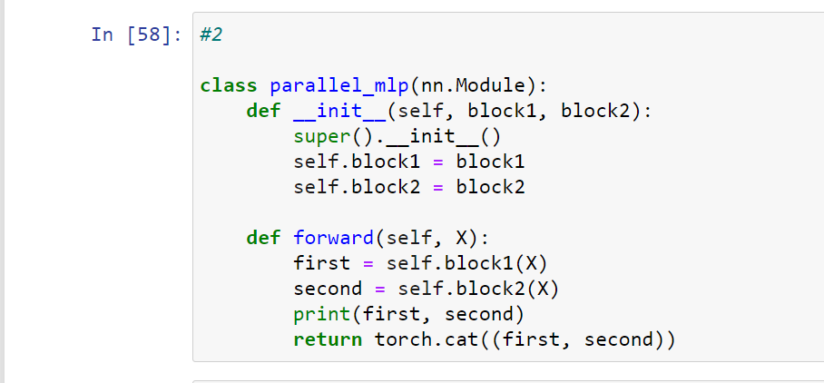
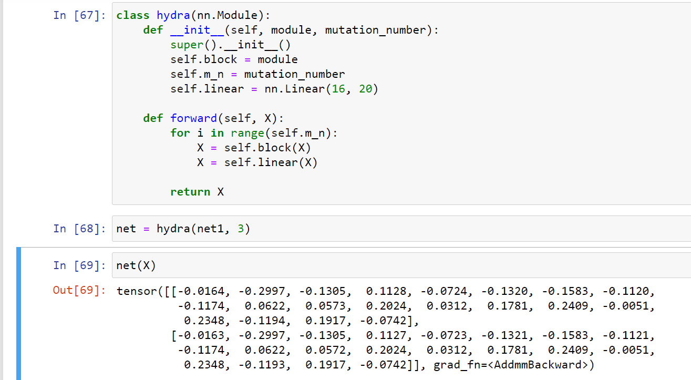
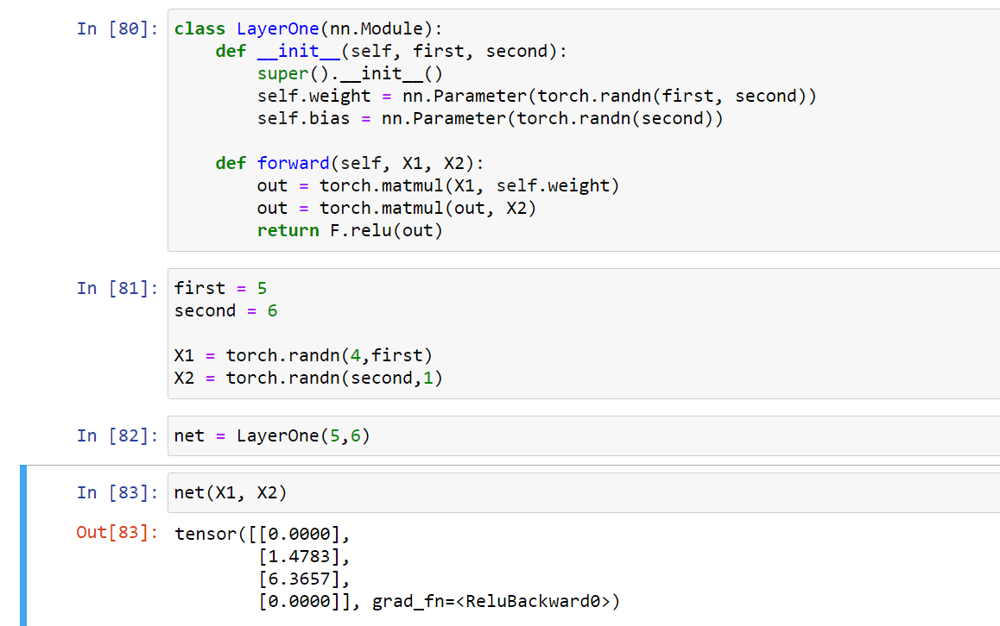
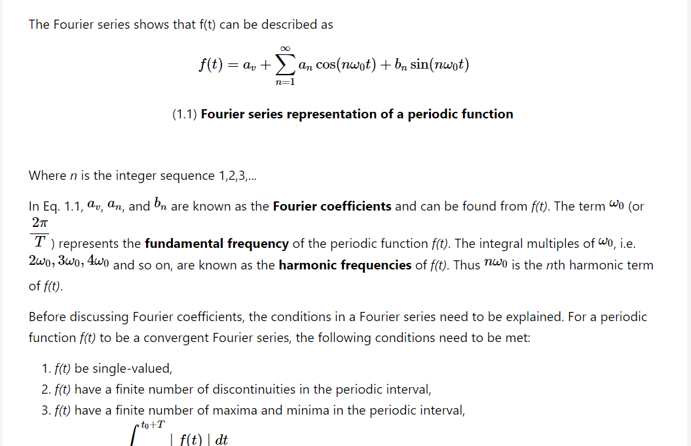
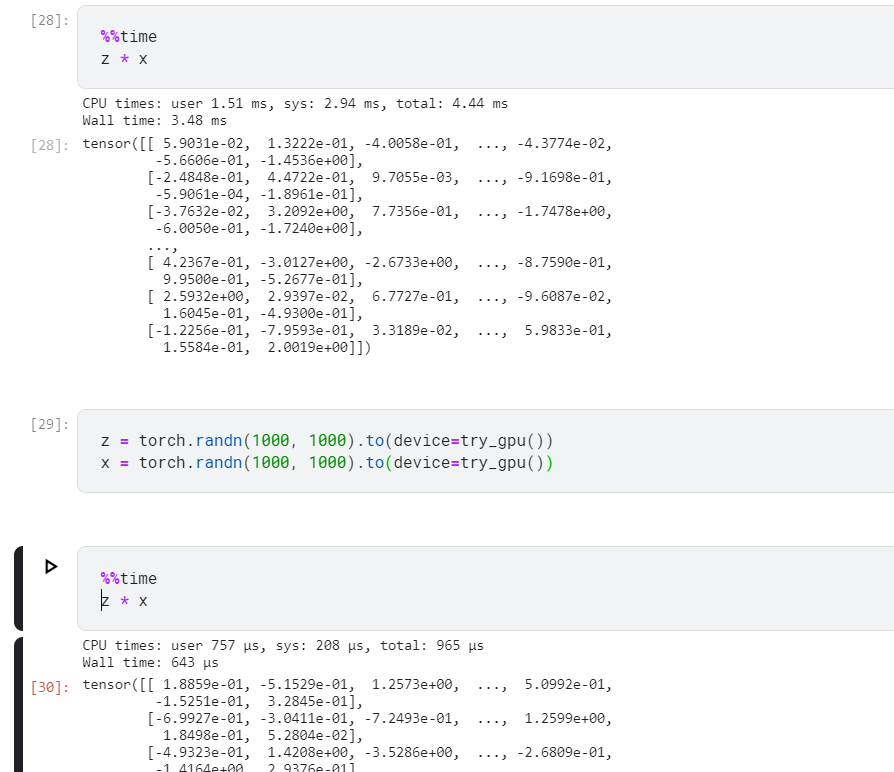

# Ch5 Deep Learning computation

- deep learning is not only helped by sophisticated hardware but also through progressindeep learning libraries.

## Layers and Block

- In softmax regression a single layer was the model, however in multi layer perceptron we had many such layers makinga model.
- When it comes to complex models we abstract it into a group of layers like convolutional neural network or linear networks.

- nn.Sequential is away to create sub module in pytorch
- net(X)is a shorthand for net.__call__(X)

- If we are to create our own module we can do it through getting the input function, generating output function as returning a value, andthen catering to initalisation, back propogationshould be handled on its own

- We can also implement Sequential function of the sequential block- its main functionality is todaisy chain blocks together.

- creating a fixed mlp class

### Exercises
1. What kinds of problems will occur if you change MySequential to store blocks in a Python
list?

* Mysequential implementation would be different.

2. Implement a block that takes two blocks as an argument, say net1 and net2 and returns
the concatenated output of both networks in the forward propagation. This is also called a
parallel block.

* 
```python
class parallel_mlp(nn.Module):
    def __init__(self, block1, block2):
        super().__init__()
        self.block1 = block1
        self.block2 = block2

    def forward(self, X):
        first = self.block1(X)
        second = self.block2(X)
        print(first, second)
        return torch.cat((first, second))
```


3. Assume that you want to concatenate multiple instances of the same network. Implement
a factory function that generates multiple instances of the same block and build a larger
network from it.



## Parameter management

### Things we need to learn
- accessing parameterfor visualisation
- paramter initialisation
- sharing accross componenets

### Parameter initialisation
- usually pytorch initialises weight uniformly by drawing from a range takinginto accoutn the input and output range
- through `net.state_dict()` you can take all the parameter as a whole

### Exercises
1. Design a layer that takes an input and computes a tensor reduction, i.e., it returns yk = i,j Wijkxixj .

* Not sure what is expected but is it the answer?


2. Design a layer that returns the leading half of the Fourier coefficients of the data.

* These are fourier series. But what is expectedoutof me 




## File I/O

- loading and retrieving tensors
```python
torch.save(x, 'x-file')
torch.load('x-file)
```
- Loading and saving model parameters- you need to define the architecture,but you can save the parameters through `net.state_dict()`

### Exercises

1. Even if there is no need to deploy trained models to a different device, what are the practical
benefits of storing model parameters?

* we can create checkpoints within the code and go back if required.

2. Assume that we want to reuse only parts of a network to be incorporated into a network
of a different architecture. How would you go about using, say the first two layers from a
previous network in a new network?

* this works `net[0].weight = nn.Parameter(clone.state_dict()['linear1.weight'])` 
  `net[1] = another_net[1]`

3. How would you go about saving the network architecture and parameters? What restrictions
would you impose on the architecture

* this works `torch.save(net, 'net')` and then load it into a new network.

## GPUs

- GPU has increased by a factor of 1000 every decade
- `nvidia-smi` stats for nerds

### Computing devices

- About how to put devices into gpu and cpu


### Exercises
1. Try a larger computation task, such as the multiplication of large matrices, and see the difference in speed between the CPU and GPU. What about a task with a small amount of calculations?

* marked difference at 100 tensors milli and micro seconds


* at 1 tensor they are comparative 1.63 ms vs 1.59 ms

2. How should we read and write model parameters on the GPU?

* by using `net.to(device=torch.device('cuda'))`

3. Measure the time it takes to compute 1000 matrix-matrix multiplications of 100 × 100 matrices and log the Frobenius norm of the output matrix one result at a time vs. keeping a log on
the GPU and transferring only the final result.

* I did not get it but the difference between time in cpu and gpu is 40ms.

4. Measure how much time it takes to perform two matrix-matrix multiplications on two GPUs
at the same time vs. in sequence on one GPU. Hint: you should see almost linear scaling.

* I have one GPU


