# Ch6 Convolutional neural network

- problem of using the same approach of training a network as we did with tabular data, makes it infeasible to do it.
- translational invariance - our network should respond similarly in same patch
- locality principle - earliestlayers should focus on local regions

### contraining the mlp

- `H(i,j) = Bias(i,j) + sumover(a,b) * W(i,j,a,b) * X(i+a, j+b)`
where a and both go over the entire dataset.

### Translational invariance

- it simply means that a shift in value of X should lead to a shift invalue of hidden representation.

`H(i,j) = Bias + sumover(a,b) * V(i,j) * X(i+a, j +b)`

### Locality principle

- we should not look far from location (i, j) to glean important information about H(i,j)

`outside some delta |a| > delta or |b| > delta , V(i,j) = 0`
`H(i,j) = Bias _ sumover(-delta, delta) (a,b) V(a,b) * X(i+a, j+b)`

- These two principles help us narrow down the parameters for our hypothesis.

## Convolutions

- Lets briefly look why the operations are known as convolutions.

how aconvolution is defined,

`(f * g)(x) = integration(f(z) * g(x-z) * dz)`

for dicrete functions f and g, we have

`(f * g)(i) =  sumover(a) (f(a))* f(i-a))`

for two dimensional tensors

`(f * g)(a,b) = sumover(a)sumover(b) * f(a,b) * g(i-a, j-b)`

- this is similar to earlier equation thatwe cameup with for convolution.

### Channels

- images are not usually 2dimenisonal but 3 dimensional

-They are also sometimes called feature
maps, as each provides a spatialized set of learned features to the subsequent layer. Intuitively,
you might imagine that at lower layers that are closer to inputs, some channels could become
specialized to recognize edges while others could recognize textures.

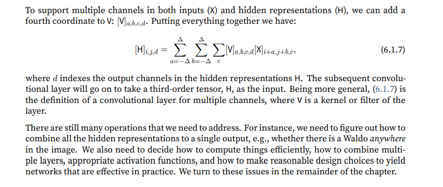

### Exercises

1. Assume that the size of the convolution kernel is ∆ = 0. Show that in this case the convolution kernel implements an MLP independently for each set of channels.

* when delta is zero in equation 6.1.7, only the sum over channel remains, which is as good as indiviually summing for each channels.

2. Why might translation invariance not be a good idea after all?

* if image are not translation invariant then that would be a problem, in case of video?

3. What problems must we deal with when deciding how to treat hidden representations corresponding to pixel locations at the boundary of an image?

* at boundary of image the offset would not be available hence padding would be required.

4. Describe an analogous convolutional layer for audio.

* for audio since we would need frequency and time to be two input layer, we need to make tehm into two features and then proceed to use the same formula for convolutional neural network for 2 parameters.

5. Do you think that convolutional layers might also be applicable for text data? Why or why
not?

* text data features would be equal to the vocabulary and they are not location dependent, even if we do a visual conversion of text data.

6. Prove that f ∗ g = g ∗ f

`(f * g)(a,b) = sumover(a)sumover(b) * f(a,b) * g(i-a, j-b)`
`(g * f)(a,b) = sumover(a)sumover(b) * g(a,b) * f(i-a, j-b) = (g * f)(c,d) = sumover(c)sumover(d) * g(i-c,j-d) * f(c, d)`
`for some c,d`

* Here is something I've sometimes wondered about. If f,g are both nonnegative proving commutativity of convolution can be done without a tedious change of variable.

* Indeed, let X be a random variable with density f and let Y be a random variable with density g. Its easy to see that f convolved with g is the density of X+Y (or in your case X+Y mod 2π). By commutativity of addition, the density of X+Y is the same as the density of Y+X and we are done!

# Convolution for images in practice

- convolution is a misnomer since what we use is cross correlation.

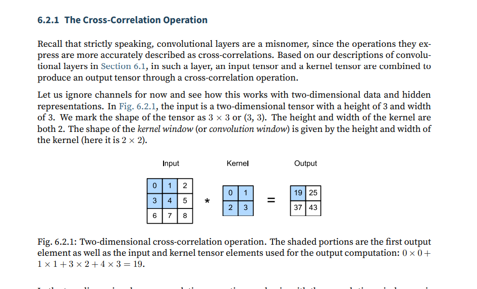

formula fo size after convolution - 

nh and nw are for hidden layer
kh and kw are for kernel,

(nh − kh + 1) × (nw − kw + 1)

## Convolutional layer

- cross correlates the input and output and adds ascalar bias, to produce a bias.

## edgedetectionin images

- we construct a kernel K with a height of 1 and a width of 2. When we perform the crosscorrelation operation with the input, if the horizontally adjacent elements are the same, the output
is 0. Otherwise, the output is non-zero.

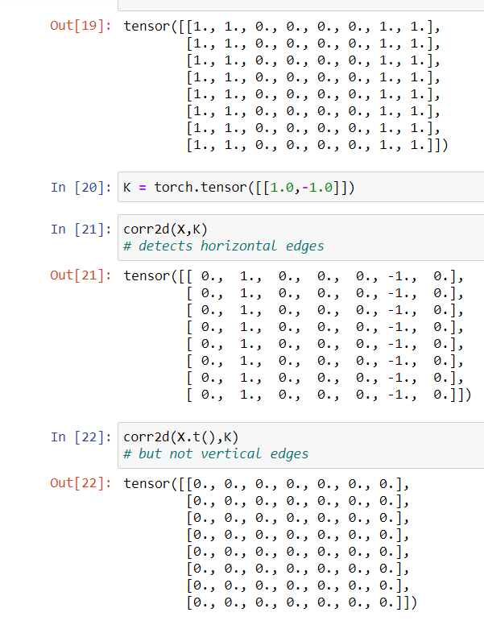

## Learning convolutional layers

- We first construct a convolutional layer and initialize its kernel as a random
tensor. Next, in each iteration, we will use the squared error to compare Y with the output of
the convolutional layer. We can then calculate the gradient to update the kernel. For the sake of
simplicity, in the following we use the built-in class for two-dimensional convolutional layers and
ignore the bias.

Do the exercise again!

## featuremap and receptive field

- feature map canbe said as learned representation in spatial dimension to the subsequent layer.
- In CNNs for anyelement x of somelayer, its receptive field refers to al the lements of the previous layers that may affect the calculation in forward propagation.
- Receptivefield may be larger than the actual calulations

### Exercises

1. Construct an image X with diagonal edges.
    1. What happens if you apply the kernel K in this section to it?
        * zero matrix.
    2. What happens if you transpose X?
        * No change
    3. What happens if you transpose K?
        * zero matrix.
        
2. When you try to automatically find the gradient for the Conv2D class we created, what kind
of error message do you see?
    * I am able to do `net.weights.grad`, when I try `net.grad` I get the error `'Conv2d' object has no attribute 'grad'`

3. How do you represent a cross-correlation operation as a matrix multiplication by changing
the input and kernel tensors?
    * cross correlation is basically matrix multiplication between slices of tensorfrom X of the shape of kernel and summing.
    * It can be done by padding Kand X based on what is needed to multiply

4. Design some kernels manually.
    1. What is the form of a kernel for the second derivative?
        * okay in order to compute one way would be to manually compute the second derivative and then let see a kernel be made using backpropogation
        https://dsp.stackexchange.com/questions/10605/kernels-to-compute-second-order-derivative-of-digital-image
    2. What is the kernel for an integral?
        * how do you actually make it manually
3. What is the minimum size of a kernel to obtain a derivative of degree d
        * dont know.

### padding

- padding is important as convolutions take away most of the activations. So to detect features on the edge of the picture.
- This means that height and width of the output of  would increase

effectively size shape = (nh - kh + ph + 1)(nw - kw + pw + 1)

- in many cases we would tryto set ph = kh -1 and pw = kw -1
- this will make it wasier to predict output shape of the image of each layer, when construting the network
- wewill pad [ph/2]
- When the height and width of the convolution kernel are different, we can make the output and input have the same height and width by setting different padding numbers for height and width.

- for a kernel size (5,3) we take padding to be = 2, 1 as 2 * 2 + 1 * 2 = 4,2 == 5-1, 3-1

### Stride 

- sometimes we miss intermediate activations inorder to either downsampleor improve operational efficiency
- in general the output shape wehn stride is enabled is 
(nh - kh + ph + sh)/sh ,  (nw - kw +  pw + sw)/sw

if nh and wh are divisible by sh and sw then the output shape will be nh/sh, nw/sw

### Exercises
1. For the last example in this section, use mathematics to calculate the output shape to see if
it is consistent with the experimental result.

* it is consistent, |(8 -3 + 0 + 3)/3| , |(8-5+1+4)/4|

2. Try other padding and stride combinations on the experiments in this section.

*  hmm tried

3. For audio signals, what does a stride of 2 correspond to?

* it might be two time peridod long

4. What are the computational benefits of a stride larger than 1

* efficiency in calculation,downsampling

## Multiple input and output channels

-let talk about multiple inputs and multiple channels

### Multiple input channel

when there are multiple inputs then each of the input is multiplied with kernel, so kernel len should beequal to the length of inputs.

However in my case it didnot happen, outputs did not match. withthe actual ansergiven inbook.

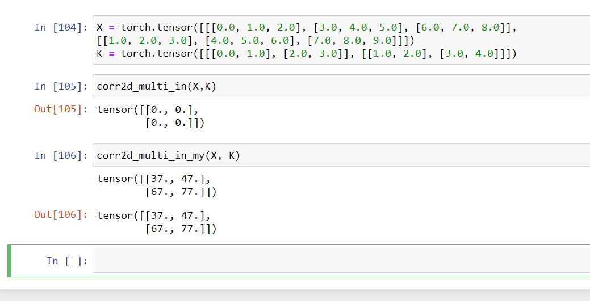

### Multiple output channel

- We stack the values together. Here. but did not work again in my case. as in we iterate of values of K.

## 1x1 conv layer

- only computation occurs in channel dimension.
- lot of complex neural network use this feature
- need to review too.

Was able to make it run but still confuse about convolutions.

### Exercises

1. Assume that we have two convolution kernels of size $k_1$ and $k_2$, respectively (with no nonlinearity in between).
    1. Prove that the result of the operation can be expressed by a single convolution.
    * not sure

    * tried to code it unsuccessfully
    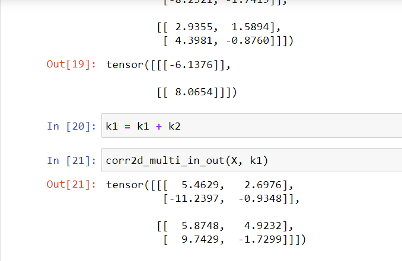

    1. What is the dimensionality of the equivalent single convolution?
    * dont know
    1. Is the converse true?
    * dont know
    
1. Assume an input of shape $c_i\times h\times w$ and a convolution kernel of shape $c_o\times c_i\times k_h\times k_w$, padding of $(p_h, p_w)$, and stride of $(s_h, s_w)$.
    1. What is the computational cost (multiplications and additions) for the forward propagation?
    1. What is the memory footprint?

    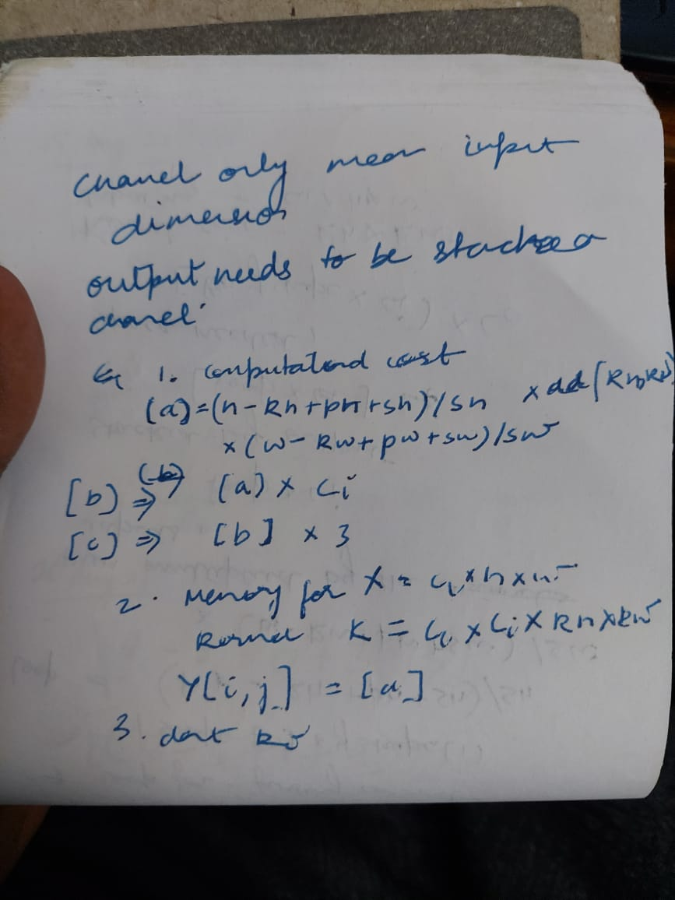
    
    1. What is the memory footprint for the backward computation?
    * dont know
    
    1. What is the computational cost for the backpropagation?
    * dont know
    
1. By what factor does the number of calculations increase if we double the number of input channels $c_i$ and the number of output channels $c_o$? What happens if we double the padding?

    * calculations would be multiplied by $c_i$  and if $c_o$ it would be multiplied by length of $c_o$
    * if we double the padding then calculation would be h-kh+ph* 2,w - kw + pw * 2
    
1. If the height and width of a convolution kernel is $k_h=k_w=1$, what is the computational complexity of the forward propagation?

    * h - kh + 1, w - kw + 1 =  h, w
    
1. Are the variables `Y1` and `Y2` in the last example of this section exactly the same? Why?
    
    * it cameout same for me !
    
1. How would you implement convolutions using matrix multiplication when the convolution window is not $1\times 1$?
    
    * DONT KNOW. 

    * here is my attempt

    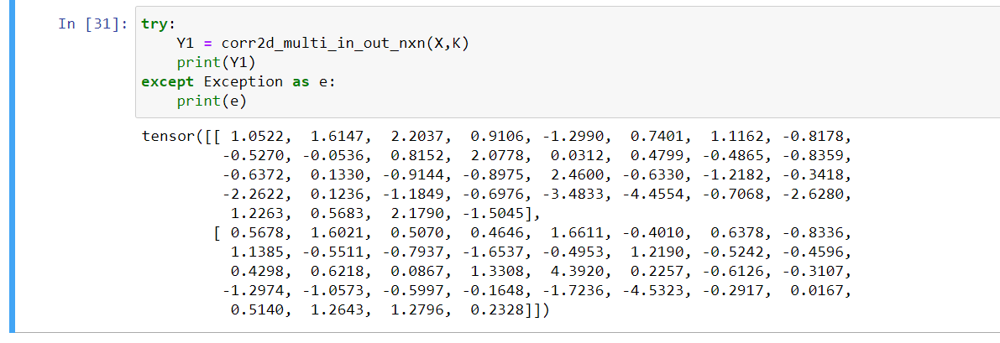

## Pooling

- thorugh the use of pooling what we are trying toaccomplish is -
1. make the final neural network insensitive to pixelshift
2. reduce the resolution of imageas we go higher up in layers, downsampling.

- pooling is simplar to cros correlation function as in it has a window that slides over the entire frame. 
- however it does not have a kernel, instead it measures the average or mean value over the window.

- pooling window of pxq would result in us having a pxq pooling layer.

### padding and stride

- by default the pool size has same dimensions. So we can say `nn.MaxPool2d(3)`

### Multiple channels

- wecan have multiple channelsof inputs, the channel isretained in maxpooling operations.

### Exercises

1. Can you implement average pooling as a special case of a convolution layer? If so, do it.
2. Can you implement maximum pooling as a special case of a convolution layer? If so, do it.

* It can be done but we need to modify the convolution layer, or find the special kernel. I couldnt so I modified the operation itself, not the right answer I guess.

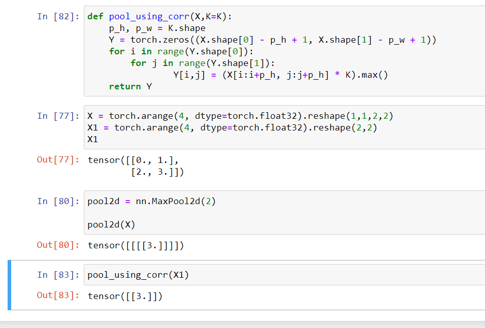

3. What is the computational cost of the pooling layer? Assume that the input to the pooling
layer is of size c×h×w, the pooling window has a shape of ph ×pw with a padding of (ph, pw)
and a stride of (sh, sw).

* I expect it to be (h- ph - sh)/sh * (w - pw -sw)/sw * len(c) * time taken to find max value.

4. Why do you expect maximum pooling and average pooling to work differently?

* because max pooling will give maximum value from the neighbors while average pooling would consider all the neighbors. I expect max pooling to be faster.

5. Do we need a separate minimum pooling layer? Can you replace it with another operation?

* This seems like a trick question, but one way is to multiply X by -1 and then do max pooling.

6. Is there another operation between average and maximum pooling that you could consider
(hint: recall the softmax)? Why might it not be so popular?

* taking average of the log and then computing the maximum value devide by sum of log. It might be computationally intensive.

# Making Lenet

- Lenet by yan lecunn was actually used in atm machines.
- Each comvolution layer uses a 5x5 kernel and a sigmoid activation function
- 6 output channel for first convolution layer while second one has 16
- 2x2 pooling operation reduces the dimensionality by a factor of 2
- . The first convolutional layer uses 2 pixels of
padding to compensate for the reduction in height and width that would otherwise result from using a 5×5 kernel. In contrast, the second convolutional layer forgoes padding, and thus the height
and width are both reduced by 4 pixels. As we go up the stack of layers, the number of channels
increases layer-over-layer from 1 in the input to 6 after the first convolutional layer and 16 after
the second convolutional layer. However, each pooling layer halves the height and width. Finally,
each fully-connected layer reduces dimensionality, finally emitting an output whose dimension
matches the number of classes

"""python
for layer in net:
    X = layer(X)`
    print(f"Shape of {layer.__class__.__name__} : {X.shape}")
"""

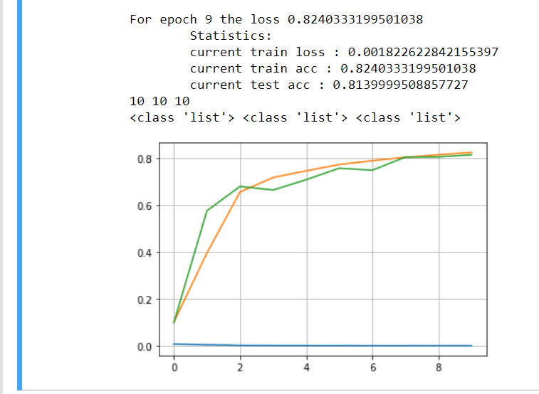

### Exercises

1. Replace the average pooling with maximum pooling. What happens?

    * has the almost the same .8177 and .8148

    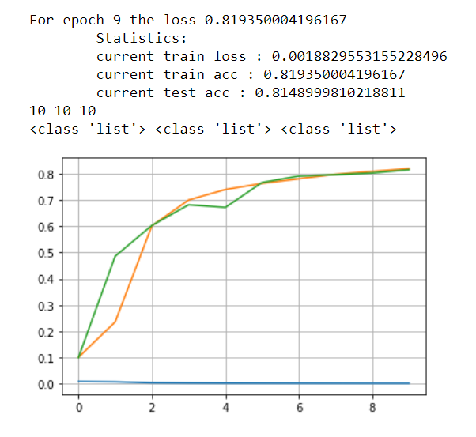

1. Try to construct a more complex network based on LeNet to improve its accuracy.
    1. Adjust the convolution window size.
    1. Adjust the number of output channels.
    1. Adjust the activation function (e.g., ReLU).
    1. Adjust the number of convolution layers.
    1. Adjust the number of fully connected layers.
    1. Adjust the learning rates and other training details (e.g., initialization and number of epochs.)
    
    * my changed network.
    ```python
    lenet_improved = nn.Sequential(nn.Conv2d(1, 6, kernel_size=5, padding=2), nn.ReLU(),
                    nn.AvgPool2d(kernel_size=2, stride=2),
                    nn.Conv2d(6, 16, kernel_size=5), nn.ReLU(),
                    nn.AvgPool2d(kernel_size=2, stride=2),
                    nn.Conv2d(16, 32, kernel_size=4), nn.ReLU(),
                    nn.AvgPool2d(kernel_size=2, stride=2), nn.Flatten(),
                    nn.Linear(32, 240), nn.ReLU(),
                    nn.Linear(240,120), nn.ReLU(),
                    nn.Linear(120, 84), nn.ReLU(), nn.Linear(84, 10))

    ```
    
1. Try out the improved network on the original MNIST dataset.

    * did try.

    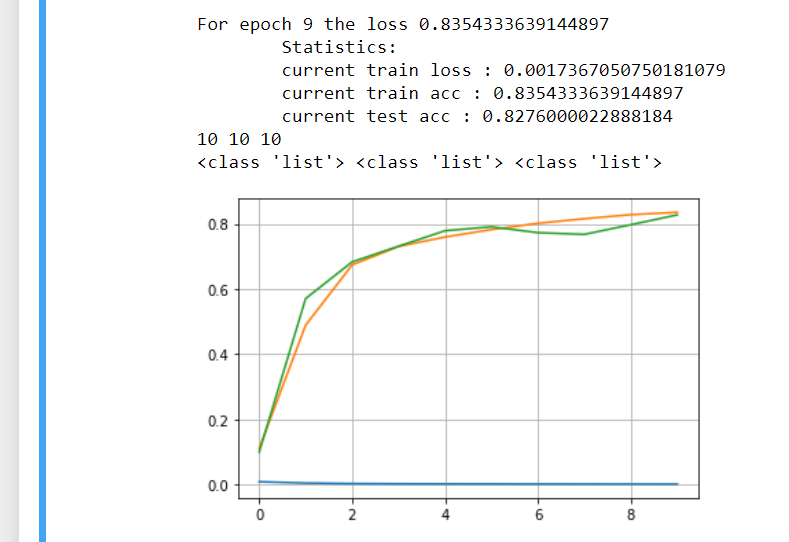
    
1. Display the activations of the first and second layer of LeNet for different inputs (e.g., sweaters and coats).

    * was this what was meant?
    
    ```python
    activation_from_first = nn.Sequential(net[0], net[1])
    activation_from_second = nn.Sequential(net[0],net[1], net[2], net[3])

    activation_from_first(X[0].unsqueeze(0)).shape, activation_from_second(X[2].unsqueeze(0)).shape

    ```
    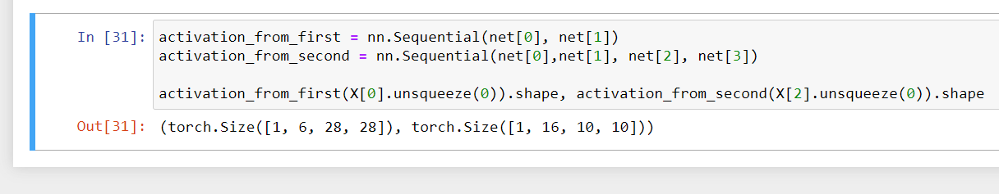

