# Ch7 Mordern Convolutional Networks

maybe I take this class after this chapter:  https://cs231n.github.io/convolutional-networks/#overview

* we would be using multiple architectures and implementing it

* reason for the growth - 1. good dataholding capacity 2. good gpu

## Alexnet

- won the image recognition contest in 2012 with a phenomenal margin.

- Here, we use a larger 11 x 11 window to capture objects. At the same
time, we use a stride of 4 to greatly reduce the height and width of the
output. Here, the number of output channels is much larger than that in
LeNet

however alexnet takesa longtime and also is not training,
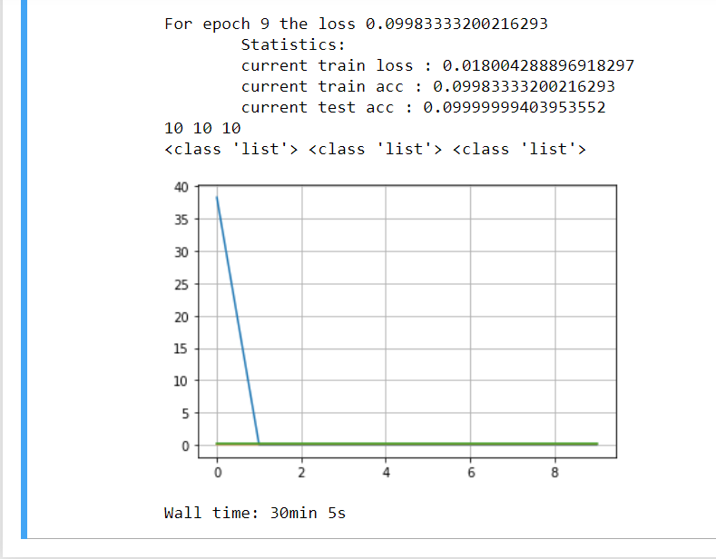

Due to memory error goota try on kaggle to train: 

https://www.kaggle.com/fanbyprinciple/implementing-cnns-in-the-name-of-fashion/edit

However facing cuda outof memrot error for batch size 128 and 224,
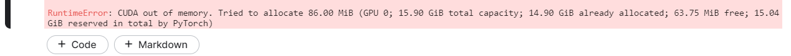

and batch size 64 :
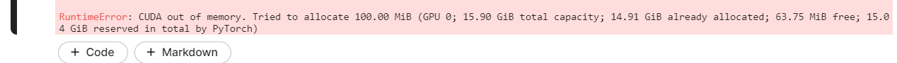

Intrestingly batch size of 64 uses more memory.

Even google colab says no:


https://colab.research.google.com/drive/1a7BYx_BboxomAJ4vSs8o3UoDy4ceC0e_#scrollTo=uymUYJeKxv2E


### Exercises
1. Try increasing the number of epochs. Compared with LeNet, how are the results different? Why?

Finally was able to "train" it but it looks more like a heartbeat than anything

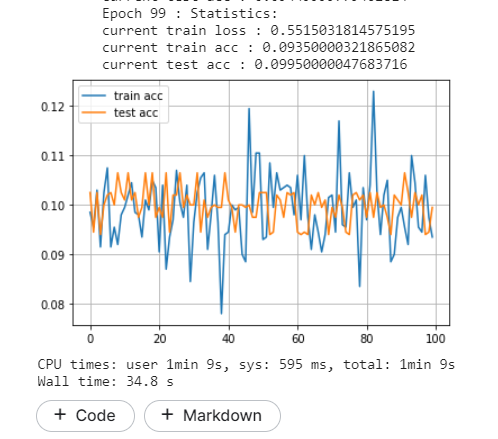


* The result is a very noisy function, it is like its not getting trained at all.

2. AlexNet may be too complex for the Fashion-MNIST dataset.
    1. Try simplifying the model to make the training faster, while ensuring that the accuracy
    does not drop significantly.

    * done but accuracy has still not improved.

    2. Design a better model that works directly on 28 × 28 images.

    * done. 

3. Modify the batch size, and observe the changes in accuracy and GPU memory.

* more batch size more consumption

4. Analyze computational performance of AlexNet.

    * any idea how to do it ?

    1. What is the dominant part for the memory footprint of AlexNet?
        * Linear network and 3 cnns
    2. What is the dominant part for computation in AlexNet?
        * the neuralnetwork 3 cnns
    3. How about memory bandwidth when computing the results?
        * more than 128 mb
5. Apply dropout and ReLU to LeNet-5. Does it improve? How about preprocessing?

   ```python
    
    lenet_5 = nn.Sequential(nn.Conv2d(1, 6, kernel_size=5, padding=2), nn.ReLU(),
                    nn.AvgPool2d(kernel_size=2, stride=2),
                    nn.Conv2d(6, 16, kernel_size=5), nn.ReLU(),
                    nn.AvgPool2d(kernel_size=2, stride=2), nn.Flatten(),
                    nn.Linear(16 * 5 * 5, 120), nn.ReLU(), nn.Dropout(p=0.5),
                    nn.Linear(120, 84), nn.ReLU(), nn.Linear(84, 10))
   ```

    its not training well as well, 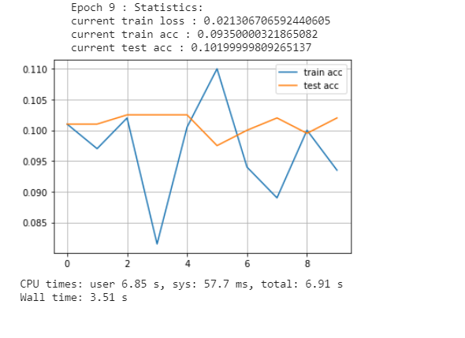

Trying to train a new network to verify my accuracy

https://www.kaggle.com/fanbyprinciple/cifar10-with-pytorch/edit

This is atleast more like it
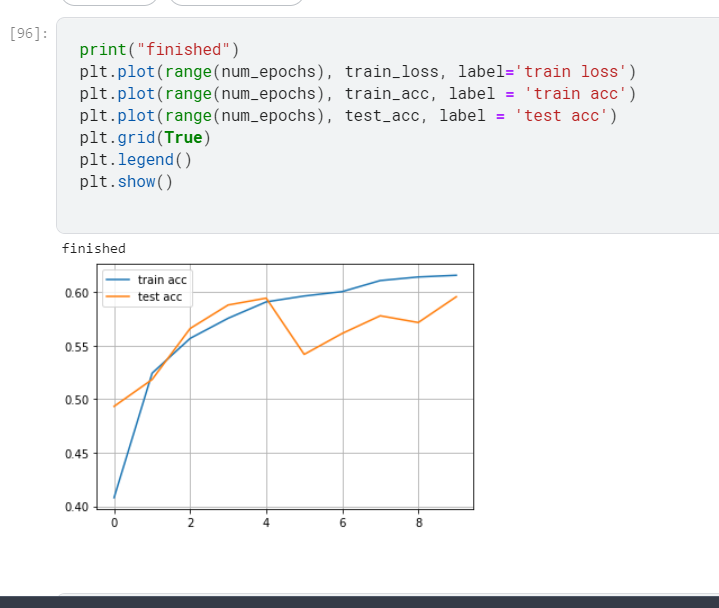

Based on that I created another notebook for a smaller alexnet model

https://www.kaggle.com/fanbyprinciple/alex-net-small/edit

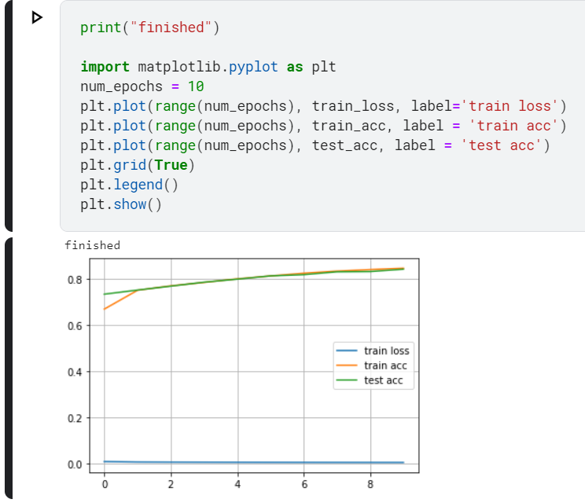

## VGG network

- VGG stands for visual geometry group, eponymously giving it their name to repeating blocks

### VGG blocks

- One block consists of a convolutional layer with padding, Non linearity such as ReLU, and then a maxpooling layer

- The origanl authors employed a 3x3 kernelwith a padding of 1 and 2x2 maxpooling layer

- Similar to alexnet and lenet, VGG also has linear layers aftwerwars

- since again it difficult to make VGG 11 work we used a new architeture VGG7

didnt train at .001

Trying to load a VGG from path

```python
import torch 
import torchvision
import os

# Suppose you are trying to load pre-trained resnet model in directory- models\resnet

os.environ['TORCH_HOME'] = 'models\\resnet' #setting the environment variable
resnet = torchvision.models.resnet18(pretrained=True)
```

Even when trying multiple lr the trianing is indifferent

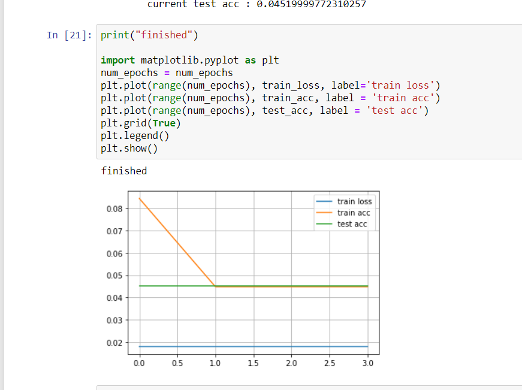

### Exercises

1. When printing out the dimensions of the layers we only saw 8 results rather than 11. Where
did the remaining 3 layer information go?

* in maxpool

2. Compared with AlexNet, VGG is much slower in terms of computation, and it also needs
more GPU memory. Analyze the reasons for this.

* it has more conv layers also linear layer take most of the memory

3. Try changing the height and width of the images in Fashion-MNIST from 224 to 96. What
influence does this have on the experiments?

* it willrun faster, it may fail at lower resolutions

4. Refer to Table 1 in the VGG paper (Simonyan & Zisserman, 2014) to construct other common
models, such as VGG-16 or VGG-19.

* it can be done but my GPU says hi
```python
VGG_19_arch = ((2,64), (2,128), (2,256), (4,512), (4,512))

VGG_16_arch = ((2,64), (2,128), (2,256), (3,512), (3,512))

```

Maybe I need to look at alex perrson on how totrain.

I was able to train a pretrained model.
Here: https://www.kaggle.com/fanbyprinciple/fine-tuning-a-vgg-model-on-custom-dataset/edit

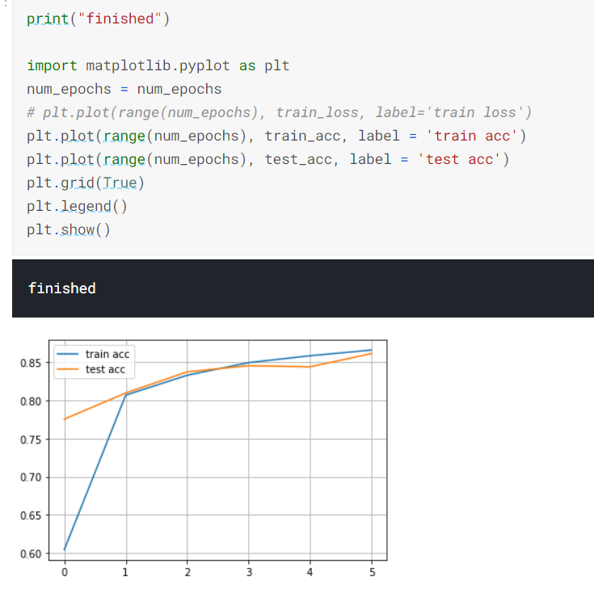

Refer to revisit folder for more info.

## network in Network

Network in network is about to use an MLP on each pixel of channel seperately. 
So it will 1x1 convolution across the image. 

The NiN block consists of one convolutional layer followed by two 1 × 1 convolutional layers that act
as per-pixel fully-connected layers with ReLU activations. The convolution window shape of the
first layer is typically set by the user. The subsequent window shapes are fixed to 1 × 1.

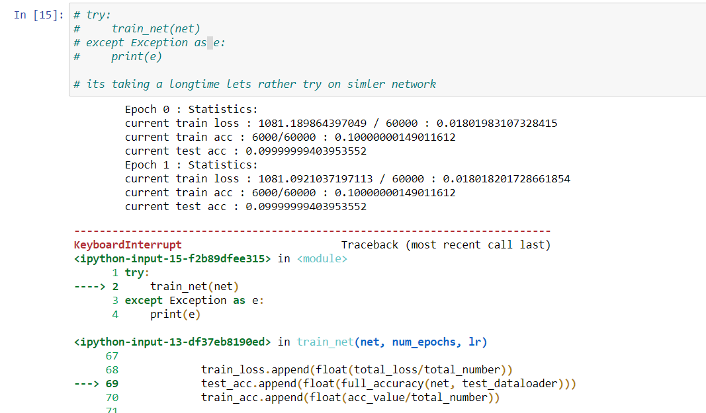

Need to design a new cnn to combat this.

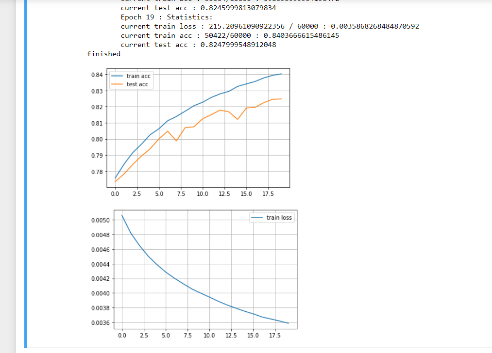

### Exercises

1. Tune the hyperparameters to improve the classification accuracy.
    * its not tuning based on stuff
    training nin
    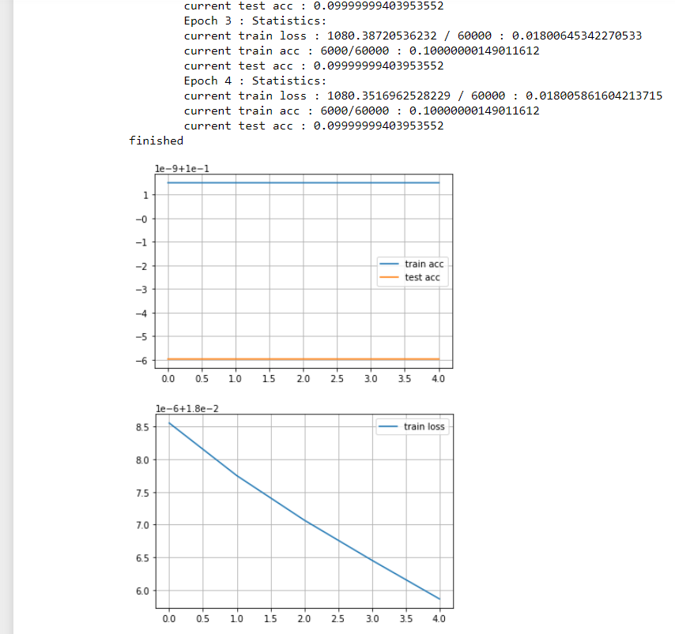

    training normal network with the same methods works
    

    So I am thinking its a learning rate issue. But how do I find an optimium lr.

2. Why are there two 1 × 1 convolutional layers in the NiN block? Remove one of them, and then observe and analyze the experimental phenomena.
    * Not able to train 1x1 I dunno
    
3. Calculate the resource usage for NiN.
    * How do you calculate this. I have been seeing this question for past few exercises.
    1. What is the number of parameters? 
    2. What is the amount of computation?
    3. What is the amount of memory needed during training?
    4. What is the amount of memory needed during prediction?

    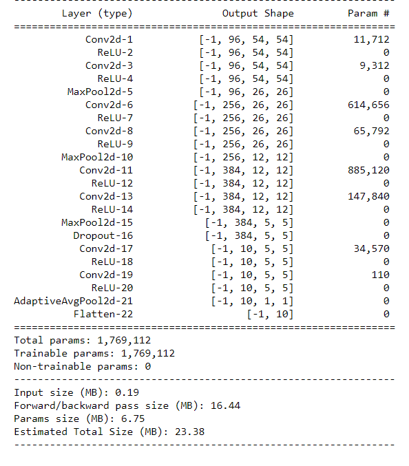
    
4. What are possible problems with reducing the 384 × 5 × 5 representation to a 10 × 5 × 5 representation in one step. 

    * the size would lead to certain problems likelosing intermediate conv layer info.

## GoogleNet

GoogLeNet won the ImageNet Challenge, proposing a structure that combined the
strengths of NiN and paradigms of repeated blocks (Szegedy et al., 2015). One focus of the paper
was to address the question of which sized convolution kernels are best. After all, previous popular networks employed choices as small as 1 × 1 and as large as 11 × 11.

it consist of 4 individual network with different activations.

To gain some intuition for why this network works so well, consider the combination of the filters.
They explore the image in a variety of filter sizes. This means that details at different extents can
be recognized efficiently by filters of different sizes.

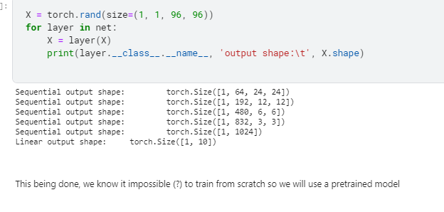

trying to train net at : https://www.kaggle.com/fanbyprinciple/inception-net/edit

### Exercises

1. There are several iterations of GoogLeNet. Try to implement and run them. Some of them include the following:

    • Add a batch normalization layer (Ioffe & Szegedy, 2015), as described later in Section 7.5.
    https://arxiv.org/pdf/1502.03167v2.pdf
    
    https://stackoverflow.com/questions/37624279/how-to-properly-add-and-use-batchnormlayer#:~:text=BatchNormLayer%20should%20be%20added%20after%20the%20dense%20or,if%20you%20added%20BatchNormLayer%20after%20or%20convolution%2Fdense%20layer.
    
    • Make adjustments to the Inception block (Szegedy et al., 2016).
    
    • Use label smoothing for model regularization (Szegedy et al., 2016)

    • Include it in the residual connection (Szegedy et al., 2017), as described later in Section 7.6.

2. What is the minimum image size for GoogLeNet to work?

* I found out that it was around 299. from https://pytorch.org/hub/pytorch_vision_inception_v3/

it says that :

```
All pre-trained models expect input images normalized in the same way, i.e. mini-batches of 3-channel RGB images of shape (3 x H x W), where H and W are expected to be at least 299. The images have to be loaded in to a range of [0, 1] and then normalized using mean = [0.485, 0.456, 0.406] and std = [0.229, 0.224, 0.225].
```
3. Compare the model parameter sizes of AlexNet, VGG, and NiN with GoogLeNet. How do the
latter two network architectures significantly reduce the model parameter size?

* GoogleNet has 22 layer, and almost 12x less parameters (So faster and less then Alexnet and much more accurate).
* without counting the aux it has 51668 parameters.
* function to calculate the parameters
```python
counter = 0

for param in inception.parameters():
    counter += len(param)
print(counter)
```

## Batch Normalisation

### why ? 

- standardisation

- activation magnitudes are different

- deep networks face overfitting issue

### how ?

- we first normalize the inputs (of batch normalization) by subtracting
their mean and dividing by their standard deviation, where both are estimated based on the statistics of the current minibatch. Next, we apply a scale coefficient and a scale offset. It is precisely
due to this normalization based on batch statistics that batch normalization derives its name.

`BN = gamma * X - ub/sigmab + betab`

-Where, gamma is the scale parameter.
       ub is the mean of batch
       sigmab is th estandard deviation
       betab is the shiftparameter.
gamma and betab have the same shape as x.

- batch normalisation allows for aggressive training rates

- sigmab of devaition = 1/batchsize * sumoverbatch(x-meanofbatch)^2+ epsilon

- we add epsilon so that there should be no divisoin by zero error.

- Batch boramalisation is different for filly connected layers and convolutional network

1. For fully connected layers

- Denoting the input to the fully-connected layer by x, the affine transformation by Wx + b
(with the weight parameter W and the bias parameter b), and the activation function by ϕ, we
can express the computation of a batch-normalization-enabled, fully-connected layer output h as
follows:
- h = ϕ(BN(Wx + b)).


2. For Convolutional Layers

- Similarly, with convolutional layers, we can apply batch normalization after the convolution and
before the nonlinear activation function. 

- When the convolution has multiple output channels, we
need to carry out batch normalization for each of the outputs of these channels, and each channel
has its own scale and shift parameters, both of which are scalars. 

- Assume that our minibatches contain m examples and that for each channel, the output of the convolution has height p and
width q. For convolutional layers, we carry out each batch normalization over the m·p·q elements
per output channel simultaneously. Thus, we collect the values over all spatial locations when
computing the mean and variance and consequently apply the same mean and variance within a
given channel to normalize the value at each spatial location.

- Putting aside the algorithmic details, note the design pattern underlying our implementation of
the layer. Typically, we define the mathematics in a separate function, say batch_norm. We then
integrate this functionality into a custom layer, whose code mostly addresses bookkeeping matters, such as moving data to the right device context, allocating and initializing any required variables, keeping track of moving averages (here for mean and variance), and so on. This pattern
enables a clean separation of mathematics from boilerplate code.

## Controversy regarding batch norm

- authors mentioned that batch norm works due to covariate shift, however it is seen that

However when we try to train it, it isn't working that well. In fact its not working at all.
Lets try lenet on a new notebook and see.

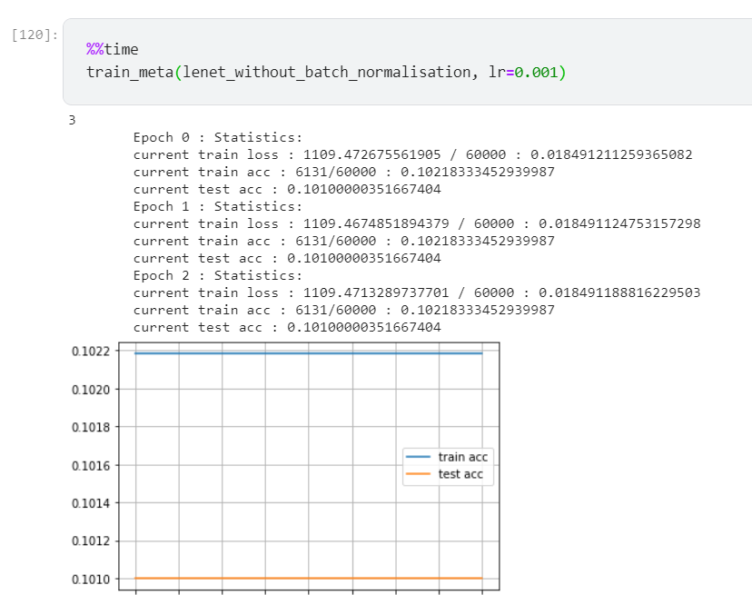

Fastai makes learning look so easy

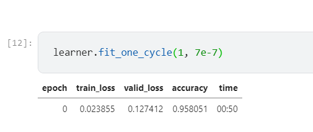

Will use it here, to find optimal learning rate.

https://docs.fast.ai/migrating_pytorch

made a kaggle notebook for using pytorch with fastai

https://www.kaggle.com/fanbyprinciple/combining-vanilla-pytorch-and-fastai/edit

batchnorm is training with the d2l function, need to create my own functions to do it.
Look in revisit folder,
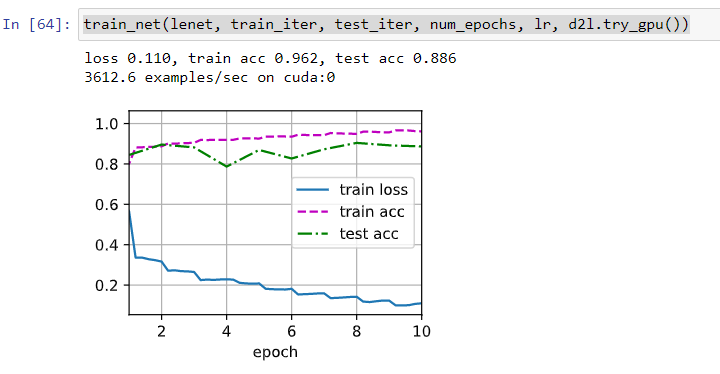


## Exercises
### Exercises and mysilly answers
1. Can we remove the bias parameter from the fully-connected layer or the convolutional layer
before the batch normalization? Why?

* Since batchnorm already includes bias, and also shift by mean any constant would be cancelled out therefore, it makes no sense to add bias.

2. Compare the learning rates for LeNet with and without batch normalization.


1. Plot the increase in training and test accuracy.
    * with batchnorm the accuracy = 0.962 at lr 1.0
    * without batchnorm the accuracy 0.931 at lr 0.1

    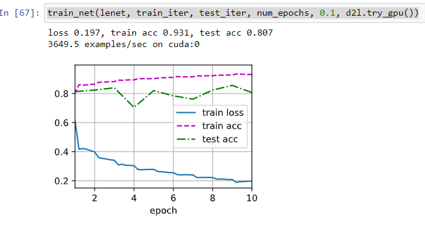

2. How large can you make the learning rate?
    * tried with 1.0
3. Do we need batch normalization in every layer? Experiment with it?
    * okay. tried it is surprisingly giving accuracy of 94.6

    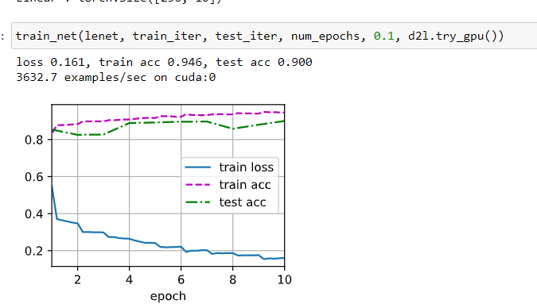

4. Can you replace dropout by batch normalization? How does the behavior change?

    * from https://stackoverflow.com/questions/39691902/ordering-of-batch-normalization-and-dropout 
       ```  
         193

    In the Ioffe and Szegedy 2015, the authors state that "we would like to ensure that for any parameter values, the network always produces activations with the desired distribution". So the Batch Normalization Layer is actually inserted right after a Conv Layer/Fully Connected Layer, but before feeding into ReLu (or any other kinds of) activation. See this video at around time 53 min for more details.

    As far as dropout goes, I believe dropout is applied after activation layer. In the dropout paper figure 3b, the dropout factor/probability matrix r(l) for hidden layer l is applied to it on y(l), where y(l) is the result after applying activation function f.

    So in summary, the order of using batch normalization and dropout is:

    -> CONV/FC -> BatchNorm -> ReLu(or other activation) -> Dropout -> CONV/FC ->
    ```
    
5. Fix the parameters beta and gamma, and observe and analyze the results.

    * okay. If it means fixing moving averages then I did it.

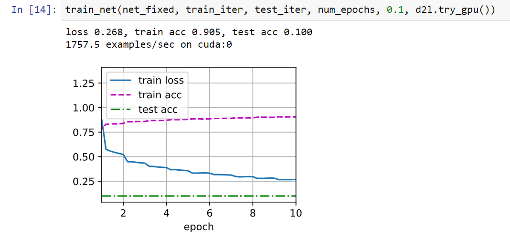

6. Review the online documentation for BatchNorm from the high-level APIs to see the other
applications for batch normalization.

https://pytorch.org/docs/stable/generated/torch.nn.BatchNorm2d.html

https://arxiv.org/abs/1502.03167

``Our method draws its strength from making normalization a part of the model architecture and performing the
normalization for each training mini-batch. Batch Normalization allows us to use much higher learning rates and
be less careful about initialization. It also acts as a regularizer, in some cases eliminating the need for Dropout.
Applied to a state-of-the-art image classification model,
Batch Normalization achieves the same accuracy with 14
times fewer training steps, and beats the original model
by a significant margin.```

7. Research ideas: think of other normalization transforms that you can apply?

Can you apply the probability integral transform? 

- https://en.wikipedia.org/wiki/Probability_integral_transform

in probability theory, the probability integral transform (also known as universality of the uniform) relates to the result that data values that are modeled as being random variables from any given continuous distribution can be converted to random variables having a standard uniform distribution.[1] This holds exactly provided that the distribution being used is the true distribution of the random variables; if the distribution is one fitted to the data, the result will hold approximately in large samples.


How about a full rank covariance estimate?

- dont know what this term is.

# The accuracy function I should use

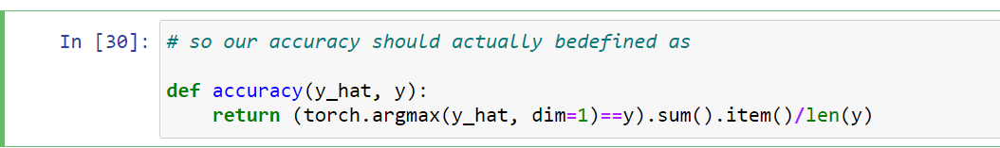


# Resnet

Deeper networks should mean better accuracy. But this is not always the case.

Only if there is a nested function and the answer is within the scope of larger network, do we get the minima. 

There are 4 convolutional layers in each module (excluding the 1×1 convolutional layer). Together
with the first 7 × 7 convolutional layer and the final fully-connected layer, there are 18 layers in
total. Therefore, this model is commonly known as ResNet-18.


