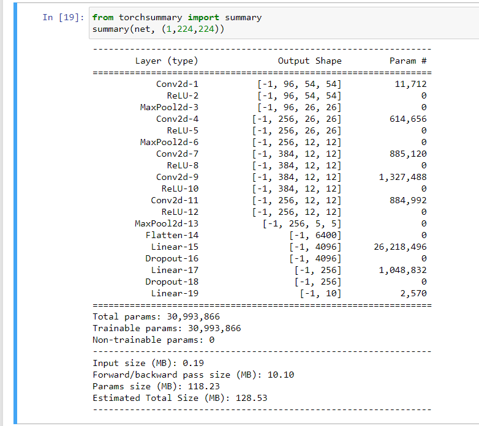
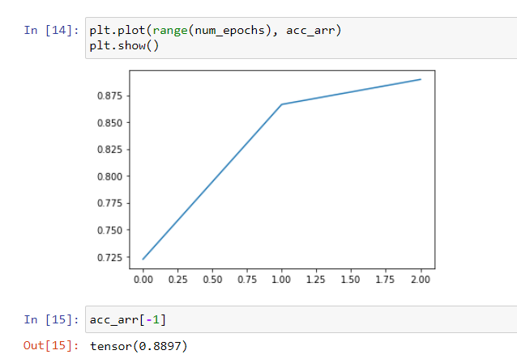
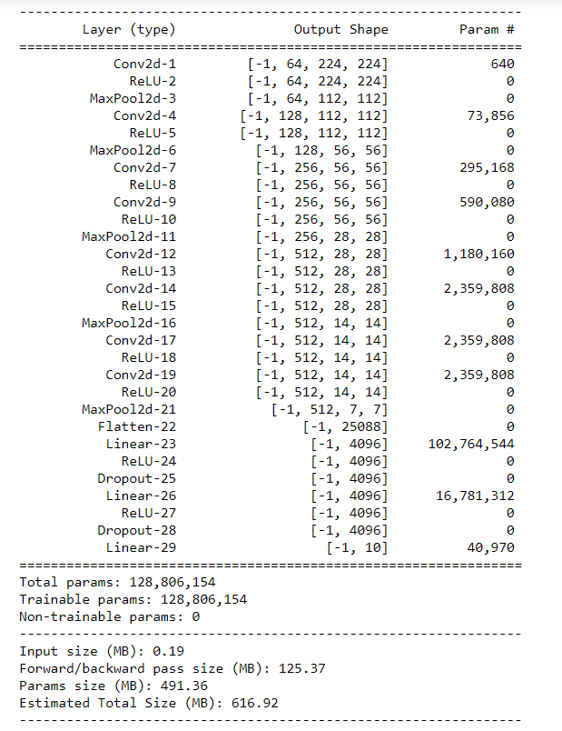
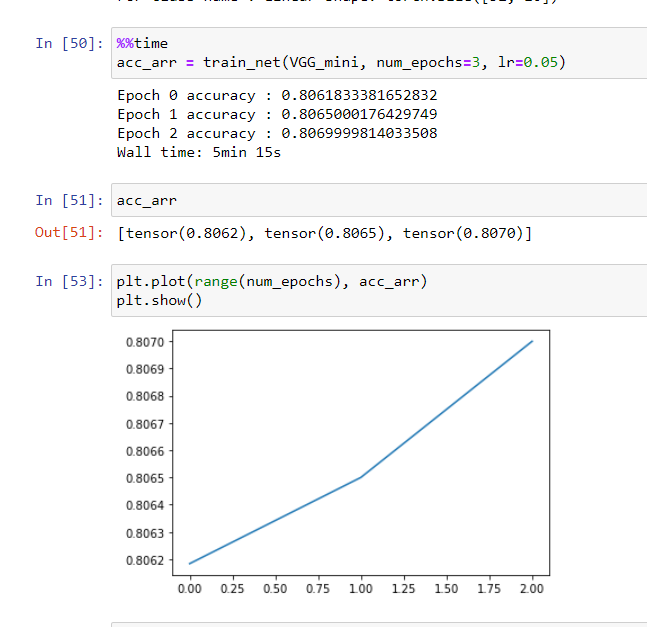
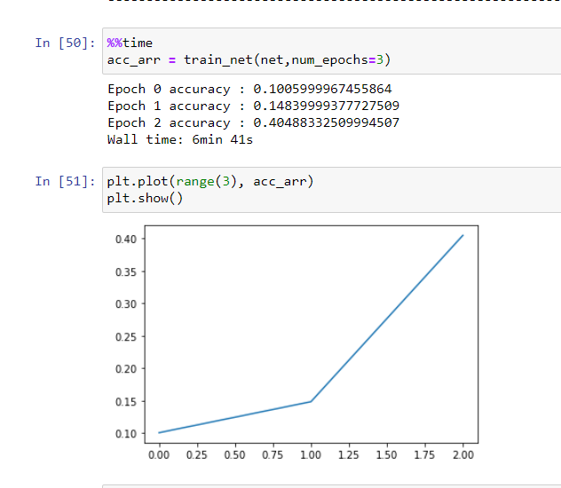

## Alexnet

Trained alex net.

Memory footprint.

## VGG 

Need to revisit softmax, negative log liklihood (page 126), nn.CrossEntropyLoss(136), SGD

it did not train at 0.05 or 0.1.

Tried again it is training at 0.05.

Another problem that I came accross wass efficient memory management. The tensors I create stay in the GPU. how to delete them after use.

## Network in network

Not exactly training properly.

