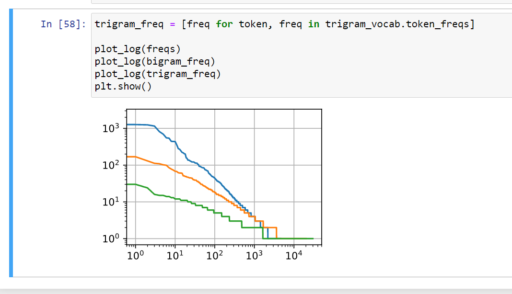

# Ch8 Recurrent Neural Networks

- With CNN we assume that the distribution of data is uniform. However that need not be the case for RNNS
- While CNNs can parse spatial information, RNN are there to parse sequential information

Sequence models are suspect to lot of biases :

1. Anchoring: during a particular Oscar ceremony the rating of the movie goes up even though its the same movie.
2. Hedonic adaptation : The new normal based on good movies, you then only tend to respect good movies.
3. Seasonality :  Santa Claus movie should be shown in December.
4. Infamous: Movies become popular for the wrong reasons.
5. Cult movie syndrome: some movies become cult movies because they are so so bad.

There are other things to consider in sequential model

1. Netflix is famous after school, while trading apps are mostly used when trade is open.
2. Estimating in between observation is interpolation, predicting future is extrapolation. We all know hindsight is easier than foresight.
3. Permutation does not work in sequential model, dog bites man isnt the same as man bites dog.
4. Things like earthquakes are strongly correlated
5. Human interact in sequential nature, they trade blows on twitter sequentially.

- we need statistical tool to deal with all these data.

Autoregressive models - models that perform regression on themselves. That is we consider them for a small time window Tau. If Tau is one we have a Markov model.
Latent Autoregressive Models - It keeps a summary ht of past observations, and at the same time update ht in addition to prediction xt

We predict this on the assumption that dynamics of the sequence wont change. This is called stationary.

Causality means that reverse would also be true.Going back and predicting in reverse through model would also work.

### skip ahead prediction

Generally, for an observed sequence up to xt
, its predicted output xˆt+k at time step t + k is called
the k-step-ahead prediction. Since we have observed up to x604, its k-step-ahead prediction is xˆ604+k.
However multistep prediction ait so simple:

s the above example shows, this is a spectacular failure. The predictions decay to a constant
pretty quickly after a few prediction steps. Why did the algorithm work so poorly? This is ultimately due to the fact that the errors build up. Let us say that after step 1 we have some error
ϵ1 = ¯ϵ. Now the input for step 2 is perturbed by ϵ1, hence we suffer some error in the order of
ϵ2 = ¯ϵ + cϵ1 for some constant c, and so on. The error can diverge rather rapidly from the true
observations. This is a common phenomenon. For instance, weather forecasts for the next 24
hours tend to be pretty accurate but beyond that the accuracy declines rapidly. We will discuss
methods for improving this throughout this chapter and beyond

### Good multistep prediction

also trying to develop autoregressive model at kaggle.com
<https://www.kaggle.com/fanbyprinciple/sequence-prediction-with-autoregressive-model/edit>

### Exercises

### Things to ponder

Improve the model in the experiment of this section.

    -Incorporate more than the past 4 observations? How many do you really need?
    (Tried. in a limited way. close to one seems better.)
    

    - How many past observations would you need if there was no noise? Hint: you can write  sin  and  cos  as a differential equation.
    (I tried with sin and cos.Its the same story. `x = torch.cos(time * 0.01)`)
    

    - Can you incorporate older observations while keeping the total number of features constant? Does this improve accuracy? Why?
    (Dont get the question)

    Change the neural network architecture and evaluate the performance.
    (tried. same)

An investor wants to find a good security to buy. He looks at past returns to decide which one is likely to do well. What could possibly go wrong with this strategy?
(Only things constant in life is change)

Does causality also apply to text? To which extent?
(The words do have some causality I believe, you can expect h to follow W at the start of a sentence with a relatively high degree of confidence. But its very topical)

Give an example for when a latent autoregressive model might be needed to capture the dynamic of the data.
(In stock market!)

# Text preprocessing

1. Load text as strings into memory.
2. Split strings into tokens (e.g., words and characters).
3. Build a table of vocabulary to map the split tokens to numerical indices.
4. Convert text into sequences of numerical indices so they can be manipulated by models
easily.

### Exercises

1. Tokenization is a key preprocessing step. It varies for different languages. Try to find another
    three commonly used methods to tokenize text.
    TreeBankWordTokenizer: It separates the word using spaces and punctuation.
    PunktWordTokenizer: It does not separate punctuation from the word
    WordPunktTokenizer: It separate punctuation from the word

2. In the experiment of this section, tokenize text into words and vary the min_freq arguments
of the Vocab instance. How does this affect the vocabulary size?

    as min_freq increases vocabulary size decreases apparently.

can we try and implement this: <https://www.kaggle.com/smokingkrils/preprocessing-visualizations-and-accuracy>#

### Trying data precoccesing with shakespeare

Error galore!

Errors rectified:

## Language models and the Dataset

We can map text into tokens. Languagemodels are very useful. as they can create grammatically correct password.

if we go by probability of a sentence containing deep learning given it already has deep then P(deep, learning)/ P(deep)

however it can be very difficult to get any probability for some words so what we do is we create something called laplace smoothing.

We add a constant to the probability.

However a model based on counts is not enough because 1. we need to store all counts
2. model doesnot capture the meaning between the words

### Markov modeling for language

. A distribution over sequences satisfies the Markov property of first order if
P(x+1 |xt, . . . , x1) = P(xt+1 | xt).

Higher orders correspond to longer dependencies. This leads to a
number of approximations that we could apply to model a sequence:
P(x1, x2, x3, x4) = P(x1)P(x2)P(x3)P(x4),
P(x1, x2, x3, x4) = P(x1)P(x2 | x1)P(x3 | x2)P(x4 | x3),
P(x1, x2, x3, x4) = P(x1)P(x2 | x1)P(x3 | x1, x2)P(x4 | x2, x3)

### Natural Language Statistics

Trying to recreate previous function tokenize and class Vocab.

decay of frequency is actually linear in log (exponential decrease)

We are on to something quite fundamental here: the word frequency decays rapidly in a welldefined way. After dealing with the first few words as exceptions, all the remaining words roughly
follow a straight line on a log-log plot. This means that words satisfy Zipf’s law, which states that
the frequency ni of the ith most frequent word is:
ni ∝ 1/i^a

which is equivalent to
log ni = −α log i + c

where α is the exponent that characterizes the distribution and c is a constant.

This should already
give us pause if we want to model words by counting statistics and smoothing. After all, we will
significantly overestimate the frequency of the tail, also known as the infrequent words. But what
about the other word combinations, such as bigrams, trigrams, and beyond?

This figure is quite exciting for a number of reasons. First, beyond unigram words, sequences of
words also appear to be following Zipfʼs law, albeit with a smaller exponent α in (8.3.7), depending
on the sequence length. Second, the number of distinct n-grams is not that large. This gives us
hope that there is quite a lot of structure in language. Third, many n-grams occur very rarely,
which makes Laplace smoothing rather unsuitable for language modeling. Instead, we will use
deep learning based models

Spiffs law - the number of words that occur in a text is always exponential

### Reading long sequence of sentences

To begin with, since a text sequence can be arbitrarily long, such as the entire The Time Machine
book, we can partition such a long sequence into subsequences with the same number of time
steps. When training our neural network, a minibatch of such subsequences will be fed into the
model

So we can do both

1. Random sampling
2. Sequence partitioning

### Exercises

1. Suppose there are 100, 000 words in the training dataset. How much word frequency and
multi-word adjacent frequency does a four-gram need to store?
    Dont get the question

2. How would you model a dialogue?
    Dont have an idea what it is prodding us to do.

3. Estimate the exponent of Zipfʼs law for unigrams, bigrams, and trigrams.
    okay.two decaying functions. Not able to make unigram.
    
    was this what we had to do?

4. What other methods can you think of for reading long sequence data?
    maybe storing them in a dict,for oft repeated words memory can be saved

5. Consider the random offset that we use for reading long sequences.
    1. Why is it a good idea to have a random offset?
        for the randomness
    2. Does it really lead to a perfectly uniform distribution over the sequences on the document?
        I dont know how to check
    3. What would you have to do to make things even more uniform?
        Would maybe take words based on some distribution.

6. If we want a sequence example to be a complete sentence, what kind of problem does this
introduce in minibatch sampling? How can we fix the problem?
    All the sentences have different number of words so we wont be able to get a minibatch tha tis uniform.
    we can pad data.

## Recurrent neural network

1.  

we introduced n-gram models, where the conditional probability of word xt at time
step t only depends on the n − 1 previous words.

If we want to incorporate the possible effect of
words earlier than time step t − (n − 1) on xt, we need to increase n.

However, the number of
model parameters would also increase exponentially with it, as we need to store |V|n numbers for
a vocabulary set V.

Hence, rather than modeling P(xt
| xt−1, . . . , xt−n+1) it is preferable to use a
latent variable model

p(xt | xt−1, . . . , xt−n+1) = p(xt |ht-1)

where ht is the hidden state of the RNN.

CUrrent hidden state ht can be calculated as a function of f(xt | ht-1)

2. When we donthave hidden state then H =  Phi(XW + B) where H is the intermediate layer
and O = Phi(HW + B) is the output layer

3. When we do have hidden states then,

Ht = phi(Xt *W + Ht-1* W +B)
Output = HW + B

## My take on RNN

What happens in rnn is that for every time we calculate the output we use the previous hidden state and its weights  and this time step hidden weight to calculate the new output which acts as the new hidden state.

X would be a n * d matrix where n is the number of time steps and d is the number of features.

output = X(t) * Wxh + H(t-1) * Whh + b
where size of x is equivalent to len(vocab)
h is the hidden size and b is equal to output size
### RNN based character modelling

We well be aiming for a model for whom one letter shifted would act as labels
as in machin ( input) -> achine (label)

Perplexity ranges from 1 to positive infinity

Perplexity can be best understood as the harmonic mean of the number of real choices that we
have when deciding which token to pick next. Let us look at a number of cases:
• In the best case scenario, the model always perfectly estimates the probability of the label
token as 1. In this case the perplexity of the model is 1.
• In the worst case scenario, the model always predicts the probability of the label token as 0.
In this situation, the perplexity is positive infinity.
• At the baseline, the model predicts a uniform distribution over all the available tokens of the
vocabulary. In this case, the perplexity equals the number of unique tokens of the vocabulary. In fact, if we were to store the sequence without any compression, this would be the
best we could do to encode it. Hence, this provides a nontrivial upper bound that any useful
model must beat.

### Exercises

1. If we use an RNN to predict the next character in a text sequence, what is the required dimension for any output?
  dimension equal to text sequence.
  
2. Why can RNNs express the conditional probability of a token at some time step based on all
the previous tokens in the text sequence?
    I wonder why. I dont think I ve understood language probability too well.

3. What happens to the gradient if you backpropagate through a long sequence?
    Reaches 0

4. What are some of the problems associated with the language model described in this section?
    We cant find the correlation between the words

## Creating RNN from scratch

Trying to understand tokenisation mechanism

### RNN Model

RNN untrained spawns the same sentence everytime.

### Gradient clipping

we do it so that we can deal with large gradients

such that g(t) is bounded by a small value., g(t) = min(g(t), clip_value)

book model RNN trained:

## Practice

