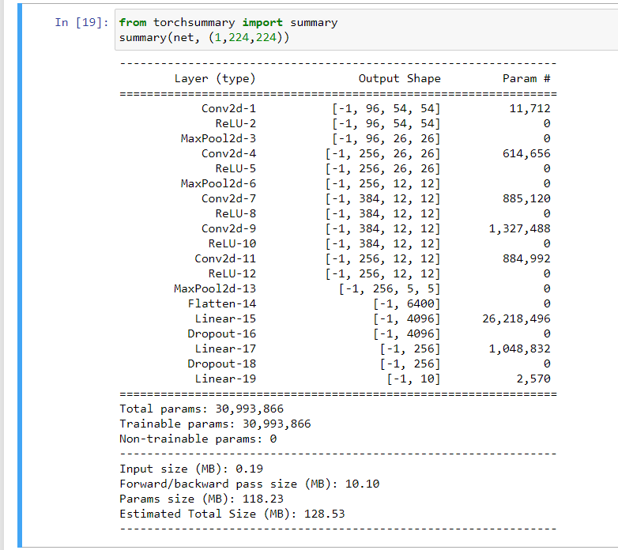

# Looking for solutions to train big networks.

1. First approach is using pretrained variables and then finetuning it.

2. Second approach is using libraries like fastai to help finetune.

3. Trying to decrease the batch size for training

https://medium.com/syncedreview/how-to-train-a-very-large-and-deep-model-on-one-gpu-7b7edfe2d072

There are four things that occupy memory in a neural network,

1. featuremap
2. gradient map
3. weights
4. Parameters in cuda

Apparently to train alexnet itself you need 2 GB of free GPU workable memory at batch size 128.

We can also,

a. Use CPU as a temporary container
b. Using VDDn the tie for training would be longer however it would be accommodated in GPU

## training lenet

With default pytorch functions,

tried lr finder. Ithink I need to update training loop.

## training alexnet

It took me 6min 21 seconds for 3 epochs and training accuracy of 88.7.The file is in revisted folder ch7.

Here is afunction for looking at network parameters:
`summary()`

## Andrej Karpathy's take

https://cs231n.github.io/convolutional-networks/#overview

- convnet are neural networks but wiht images so it allows us to design architectural changes that would make our job easier.
- With simple network, image size of 3 X 224 X 224 will have to handle atleast 150528 parameters which is a handful

