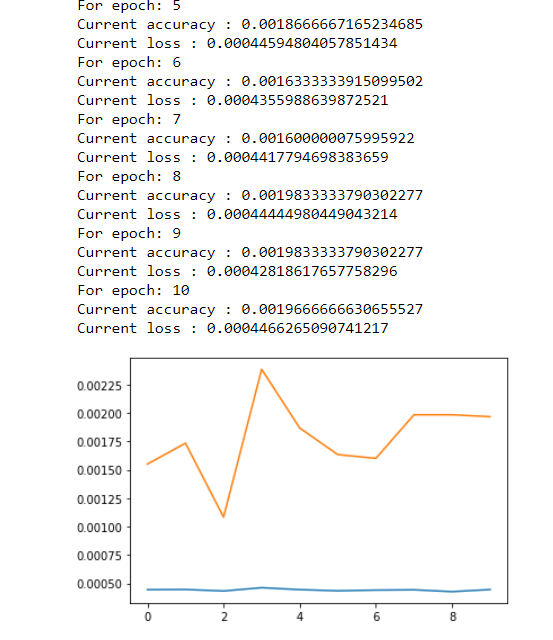
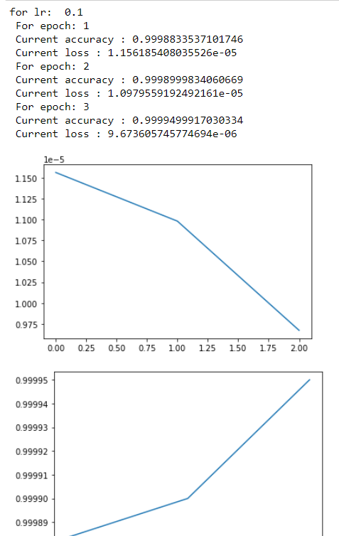

# Looking for solutions to train big networks.

1. First approach is using pretrained variables and then finetuning it.

2. Second approach is using libraries like fastai to help finetune.

3. Trying to decrease the batch size for training

https://medium.com/syncedreview/how-to-train-a-very-large-and-deep-model-on-one-gpu-7b7edfe2d072

There are four things that occupy memory in a neural network,

1. featuremap
2. gradient map
3. weights
4. Parameters in cuda

Apparently to train alexnet itself you need 2 GB of free GPU workable memory at batch size 128.

We can also,

a. Use CPU as a temporary container
b. Using VDDn the tie for training would be longer however it would be accommodated in GPU

## training lenet

With default pytorch functions,

tried lr finder. Ithink I need to update training loop.

