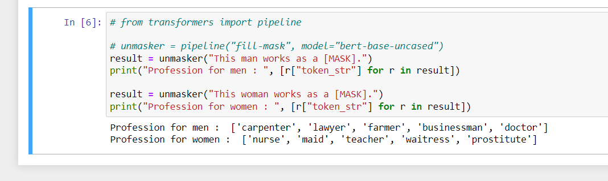
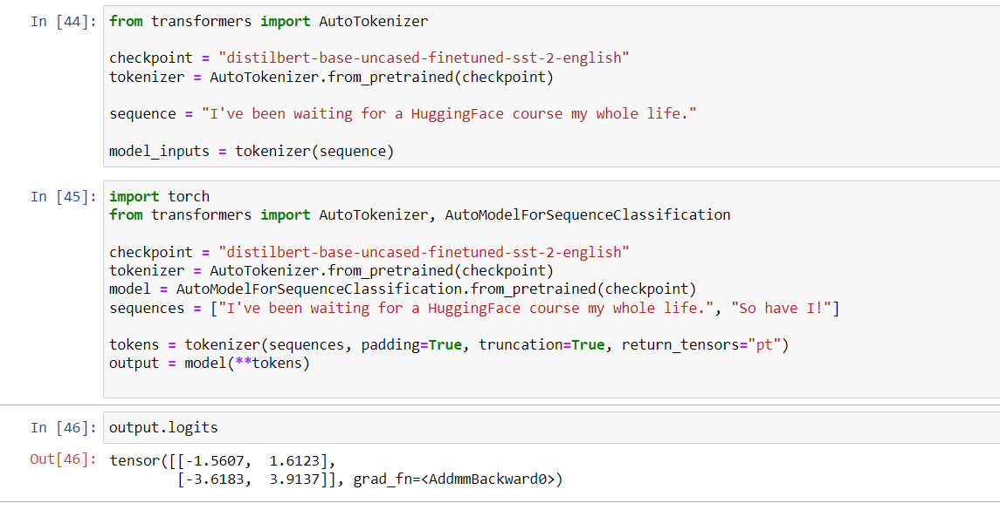

from https://huggingface.co/course/chapter1/1

# Installation

If you have a conda environment, create a new environement using
`conda create --name myenv`

`activate myenv`

Install pytorch in the environment. if you have cuda: [check commandline corresponding to your version.](https://pytorch.org/get-started/locally/)

`conda install pytorch torchvision torchaudio cudatoolkit=10.2 -c pytorch`

Install transformers from conda-forge rather than conda

`conda install -c conda-forge transformers`

Add some more packages just to be sure:

`conda install scikit-learn`

`conda install importlib-metadata`

check successful installation with

`python -c "from transformers import pipeline; print(pipeline('sentiment-analysis')('I love you'))"`

## Introduction

from page - https://huggingface.co/course/chapter1/3?fw=pt

## transformers in action

from page - https://huggingface.co/course/chapter2/1?fw=pt

## Fine tuning a pretrained model

https://huggingface.co/course/chapter3/1?fw=pt

