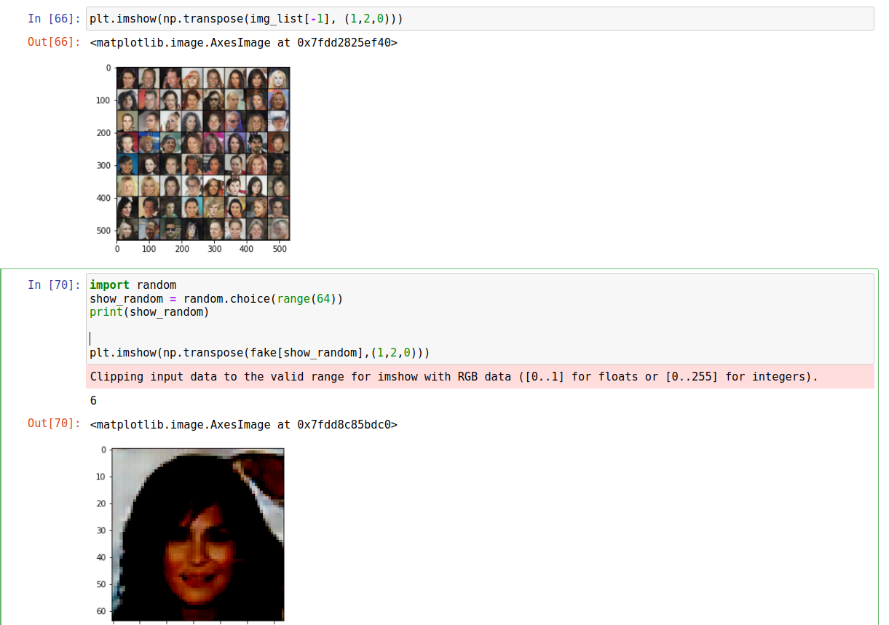

# trying to do generative gan using pytorch

for configuring git: https://linuxkamarada.com/en/2019/07/14/using-git-with-ssh-keys/#.Yl1pm1xBxH4

dataset from : http://mmlab.ie.cuhk.edu.hk/projects/CelebA.html
https://pytorch.org/tutorials/beginner/dcgan_faces_tutorial.html

using torch.cuda.devicecount we know that all devices are being detected.

need to find a way to utilise multiple gpus

check for bengali translation

HQ resolution gan - uses multiple gpu not efficiently - need to understand code

progresssive gan is gpu intensice - can it be used better with logging.

# THings to learn

how to use checkpoint parameter
Dataparrallelism efficiently
Multithreading - by default?

